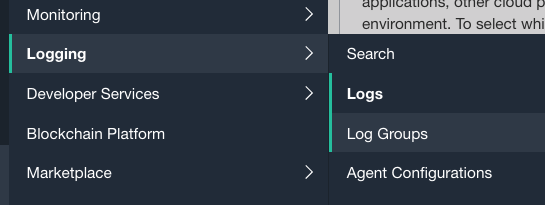
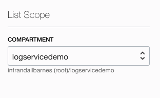
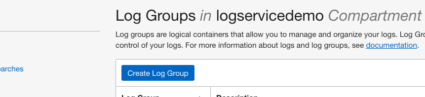
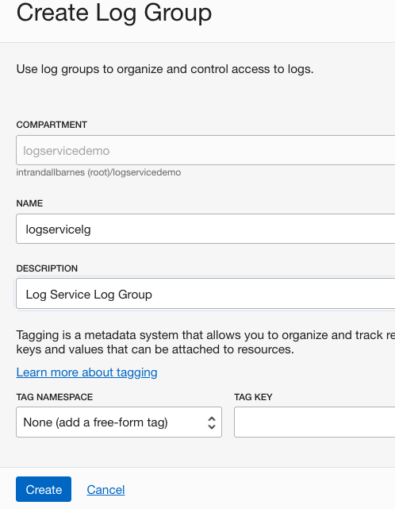

<!--
    {
        "name":"Create Log Group",
        "description":"Enable your service resource logs task 1: Create Log Group",
        "author":"Eli Schilling, Cloud Architect",
        "last_updated":"Eli Schilling, April 2026"
    }
-->

Log groups are logical containers for organizing and managing logs. Logs must always be inside  a log group. You must first create a log group to enable or create logs.  Fortunately, this is a fast and easy activity.

1. In the OCI Management Console, ensure you have selected the same Region as Lab 1.  Navigate to **Logging** --> **Log Groups**

      

2. Ensure **Compartment** logservicedemo is selected in the left column.

    
   
3. Click the **Create Log Group** button.

    

4. On the **Create Log Group** dialog page ensure **Compartment** logservicedemo is specified.  **NAME** your Log Group logservicelg, provide a brief **DESCRIPTION**, and then click the **Create** button.

    

   
   You are now ready to move on to the next step.