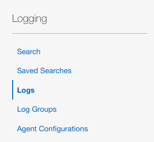
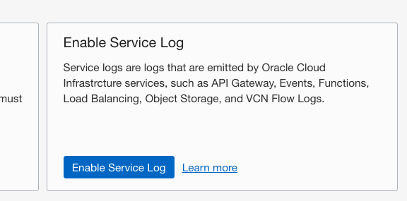

<!--
    {
        "name":"Create Log Group",
        "description":"Enable your service resource logs task 2: Enable Network Flow Log",
        "author":"Eli Schilling, Cloud Architect",
        "last_updated":"Eli Schilling, April 2026"
    }
-->

Many core cloud infrastructure services have built-in logging capabilities.  Now that you have created a Log Group in Step 1, let's select one of our core services and enable logging.  In this step, you will enable logging on the **Virtual Cloud Network** created in Lab 1.

1.  Select **Logs** in the left column of the OCI Management Console.  This can be found in the **Logging** service in case you no longer have that page open. 

    

2.  Select **Enable Service Log** to open the Enable Resource Dialog page.  

    

3.  On the **Enable Resource Log** page:
    - Ensure **Compartment** logservicedemo is listed
    - Choose **Virtual Cloud Network (subnets)** from the **Service** drop-down
    - Select **RESOURCE** logservicesub01
    - In the **Configure Log** section **Name** your log as shown in the image
    - Click **Enable Log** to complete the task

    

4.  Review the Log details page.  It may take a couple minutes for the service to complete configurations.

    

5.  You may explore log content directly from the Log properties page. Note: Full log search activities are covered in a later Lab section.

    
