# Clean Up Resources

## Introduction

In this lab, you will terminate and delete all of the resources you created throughout this workshop. Properly cleaning up resources ensures you do not incur unexpected charges and keeps your tenancy organized.

OCI provides **Tenancy Explorer** as a central tool to view every resource across all compartments and regions in a single page. You will use it to verify that all resources have been removed after working through the individual deletion steps below.

Estimated Time: 15 minutes

### Objectives

In this lab, you will:
- Detach and delete the block volume created in Lab 5
- Delete the object storage bucket and its contents created in Lab 6
- Terminate the compute instance created in Lab 4
- Verify all resources have been removed using Tenancy Explorer

### Prerequisites

* Completion of Labs 4, 5, and 6 of this workshop, or existing versions of those resources in your tenancy.

## Task 1: Detach and Delete the Block Volume

Block volumes must be detached from a compute instance before they can be deleted. Attempting to delete an attached volume will fail.

1. Click the **Navigation Menu** in the upper left. Navigate to **Compute**, and select **Instances**.

    

2. Click the name of your compute instance (**Web-Server**) to open the instance details page.

3. Under **Resources** in the left panel, click **Attached block volumes**.

    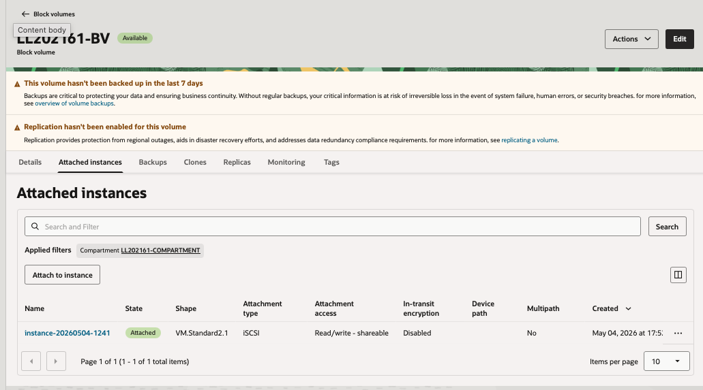

4. Locate the block volume you attached in Lab 5. Click the three-dot action menu (⋮) on the right and select **Detach block volume**.

    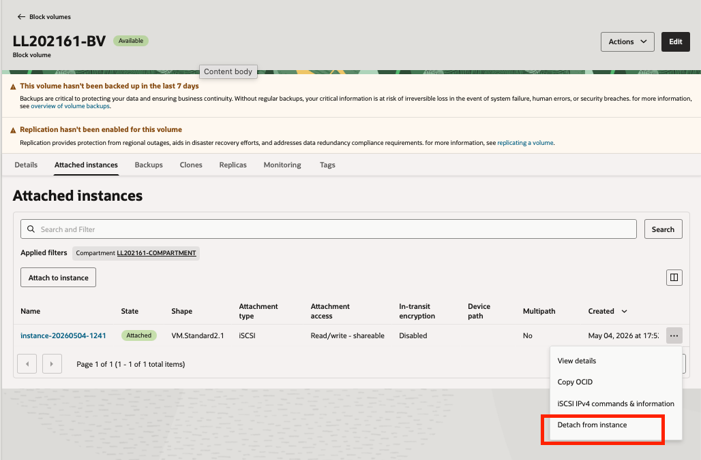

5. In the confirmation dialog, click **OK**. The volume status changes to **Detaching** and then disappears from the list once detachment is complete. This typically takes 30–60 seconds.

    >**Note:** Detaching a volume does not delete it. The volume and all of its data still exist in your tenancy and will continue to be billed until it is deleted.

6. Click the **Navigation Menu** in the upper left. Navigate to **Storage**, and select **Block Volumes**.

    

7. Confirm you are in the correct compartment. Locate your block volume in the list. Click the three-dot action menu (⋮) on the right and select **Terminate**.

8. In the confirmation dialog, click **Terminate**.

    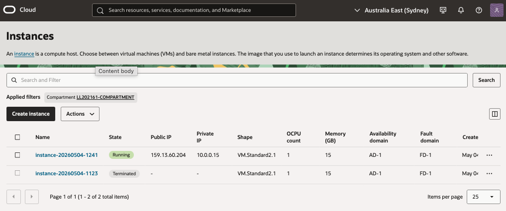

9. The volume status changes to **Terminating** and is removed from the list once deletion is complete.

    >**Note:** If the **Terminate** option is greyed out, the volume is still attached to an instance. Return to step 3 and confirm the detachment completed successfully.

## Task 2: Delete the Object Storage Bucket

An object storage bucket must be empty before it can be deleted. You will delete all objects inside the bucket first.

1. Click the **Navigation Menu** in the upper left. Navigate to **Storage**, and select **Buckets**.

    

2. Confirm you are in the correct compartment. Click the name of the bucket you created in Lab 6.

    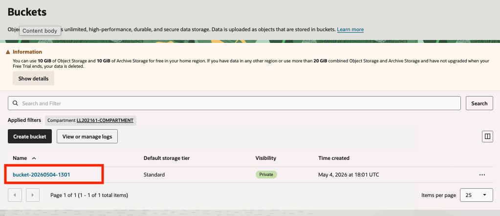

3. Under **Resources**, click **Objects** to see the list of objects in the bucket.

    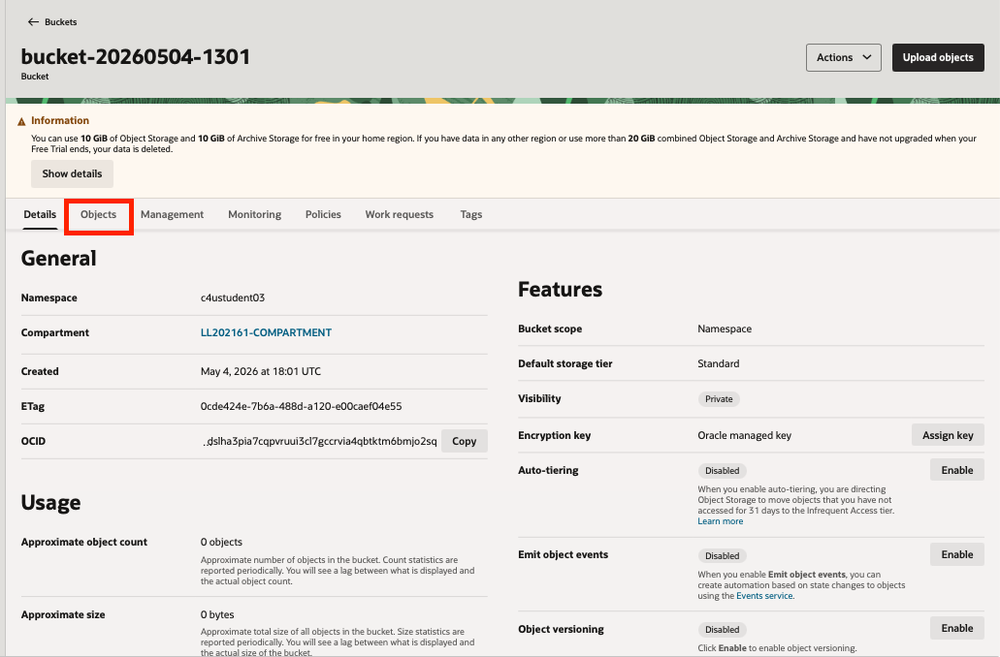

4. For each object in the list, click the three-dot action menu (⋮) on the right and select **Delete**.

    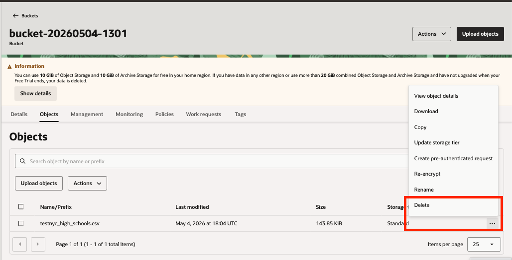
    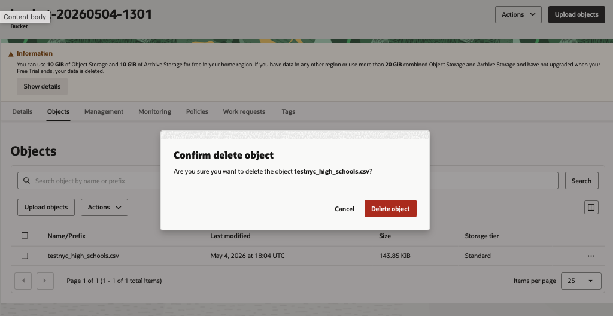

5. In the confirmation dialog, click **Delete**. Repeat for all remaining objects until the bucket is empty.

    >**Note:** If you created a Pre-Authenticated Request (PAR) in Lab 6, you do not need to delete it separately — it will be removed automatically when the bucket is deleted.

6. Navigate back to the Buckets list using the breadcrumb at the top of the page.

7. Click the three-dot action menu (⋮) next to your bucket and select **Delete**.

    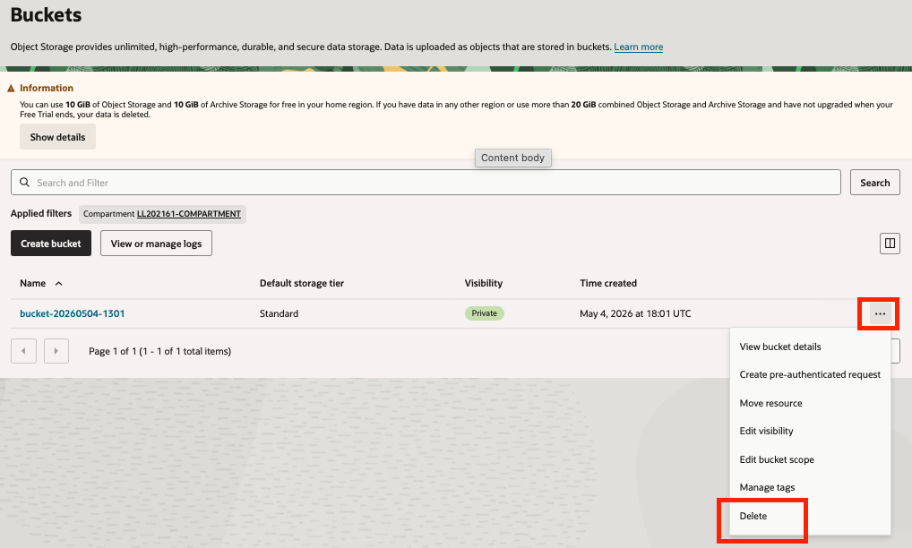

8. In the confirmation dialog, type the bucket name to confirm and click **Delete**.

    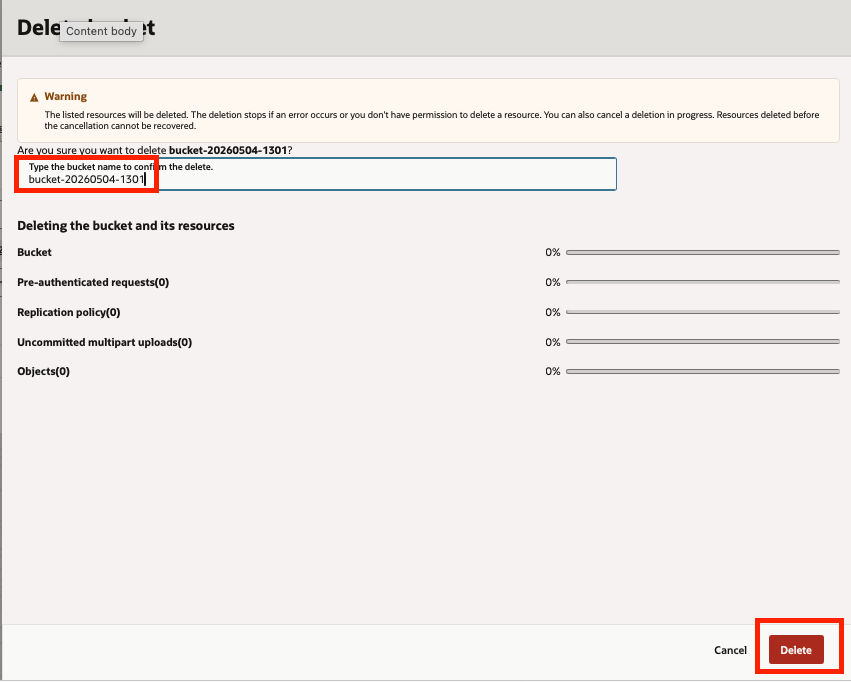

9. The bucket is removed from the list.

## Task 3: Terminate the Compute Instance

>**Warning:** Termination is **permanent and irreversible**. Before proceeding, confirm that the block volume has been detached and deleted (Task 1) and that you no longer need the instance.

1. Click the **Navigation Menu** in the upper left. Navigate to **Compute**, and select **Instances**.

    

2. Click the name of your instance (**Web-Server**) to open the instance details page.

3. Click **More Actions** in the top-right area of the page and select **Terminate**.

    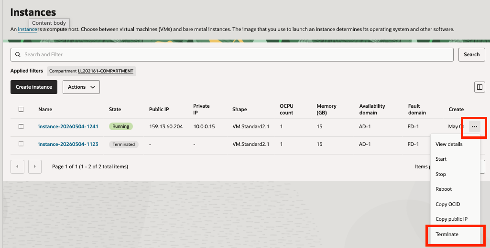

4. In the confirmation dialog, review the boot volume option:

    - **Permanently delete the attached boot volume:** Leave this **checked** to delete the boot volume along with the instance. Uncheck it only if you intend to reuse the boot volume — note that an undeleted boot volume will continue to accrue storage charges.

    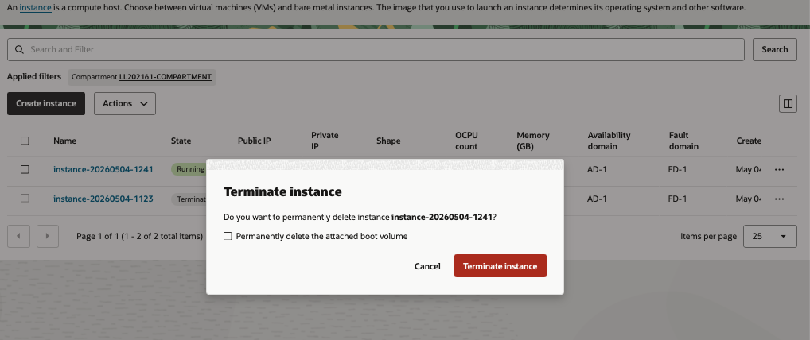

5. Click **Terminate Instance**.

6. The instance state changes to **TERMINATING**. Once complete, the instance is removed from the list.

    >**Note:** If you provisioned a **reserved public IP** in Lab 4, it is not deleted when the instance terminates — it is returned to **Available** status in your tenancy and continues to accrue a small hourly charge. Follow the steps in Task 4 below to delete it.

### Optional: Delete the Reserved Public IP

If you created a reserved public IP in Lab 4, complete these steps to remove it.

1. Click the **Navigation Menu** in the upper left. Navigate to **Networking**, and select **IP Management**, then click **Reserved Public IPs**.

    

2. Locate the reserved IP you created (for example, `web-server-reserved-ip`). Click the three-dot action menu (⋮) and select **Terminate**.

    

3. Click **Terminate** in the confirmation dialog.

## Task 4: Verify Cleanup with Tenancy Explorer

Tenancy Explorer gives you a single, region-aware view of every resource in your tenancy across all compartments. Use it as a final check to confirm nothing has been left running.

1. Click the **Navigation Menu** in the upper left. Navigate to **Governance & Administration**, and under **Tenancy Management**, select **Tenancy Explorer**.

    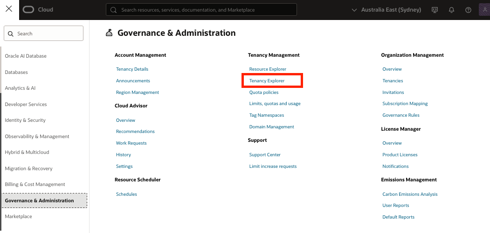

2. Use the **Resource type** filter to check for any remaining resources from this workshop. Search for each of the following types and confirm no active resources remain:

    - **Instance** — should show no RUNNING or STOPPED instances from this workshop
    - **Block Volume** — should show no volumes in AVAILABLE or PROVISIONING state
    - **Bucket** — should show no buckets from this workshop
    - **Reserved Public IP** — should show no IPs in AVAILABLE state from this workshop

    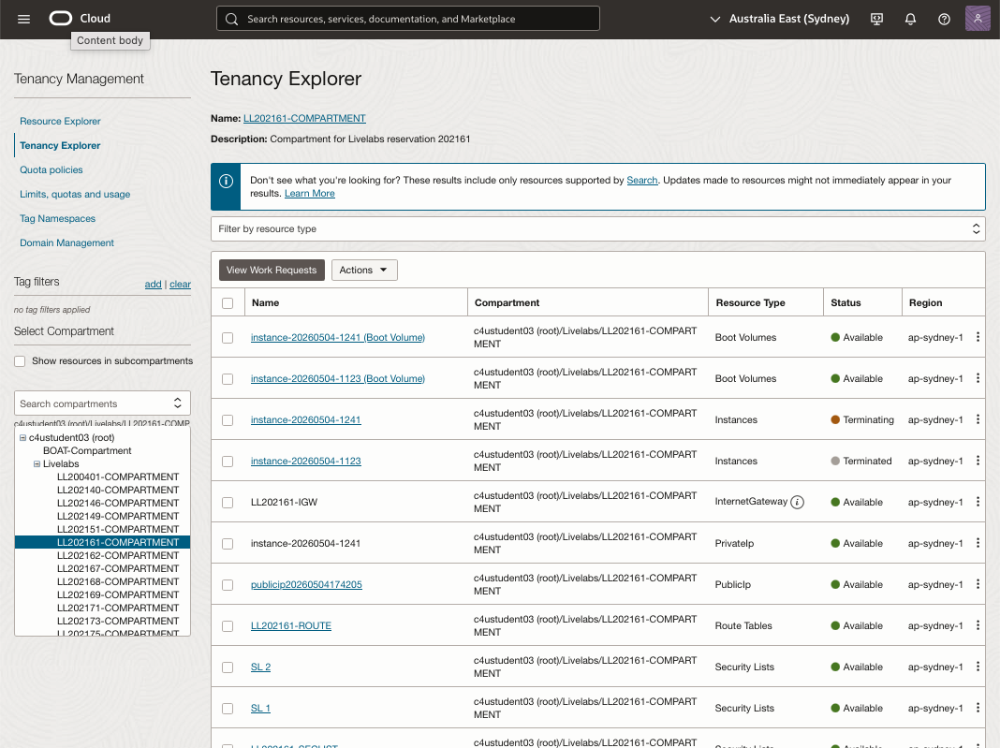

3. If you find any resources that were not cleaned up, click the resource name to navigate directly to its details page and terminate or delete it from there.

    >**Note:** Resources in a **TERMINATED** or **DELETED** state are retained in the list for a short period for audit purposes before being permanently removed. These do not incur charges and can be ignored.

Congratulations! You have successfully completed all labs in this workshop and cleaned up all associated resources.

## Acknowledgements

- **Author** - Taylor Zheng
- **Contributors** - 
- **Last Updated By/Date** - Taylor Zheng, March 2026