# Console Tour

## Introduction

Welcome to this Oracle Cloud Infrastructure (OCI) lab, where you will explore the OCI Console—the primary web-based interface for managing cloud resources.

The OCI Console provides a centralized, intuitive environment that allows users to provision, monitor, and manage cloud services such as compute instances, networking, storage, and identity access management. Whether you are a cloud beginner or an experienced practitioner, the console offers a visual and streamlined way to interact with OCI services without requiring command-line tools or APIs.

By the end of this lab, you will be able to confidently navigate the OCI Console, identify core services, and perform essential tasks that form the foundation for working in Oracle Cloud.

Estimated time: 30 minutes

### Objectives

In this lab, you will:

- Become familiar with layout of OCI Homepage
- Access Developer Tools
- Manage Regions
- Understand Annoucements and Help Options
- View important user and tenancy data

### Prerequisites

- An Oracle Cloud Account - please view this workshop's LiveLabs landing page to see which environments are supported.

>**Note:** If you have a **Free Trial** account, when your Free Trial expires, your account will be converted to an **Always Free** account. You will not be able to conduct Free Tier workshops unless the Always Free environment is available.

## Task 1: Explore the Homepage

1. Welcome to the home page of your OCI console. Once logged in you should see a similar layout below. Bring your attention to a few of the key features of the OCI Console home screen.

    - **Navigation Menu (1)**: Located in the top left of screen. This provides you access to all OCI resources. They organized into the high level categories including compute, storage, networking, database, governance and more. 

    - **Search Bar (2)**: Found centered at the top of the console home page. The search bar helps you quickly find services, resources, and documentation without navigating through menus. You can find OCI services, locate specific resources, and access documentation and help topics.

    - **Regions (3)**: Located the current regions your tenancy is subscribed to. This is where you can view your home region and any other regions that you can provision OCI resources in.

    - **Developer Tools (4)**: Quickly access developer tools like cloud shell and code editor. They provide a browser based environment where you can run commands, write code, and manage OCI resources without installing anything locally.

    - **Announcements (5)**: The Announcements section provides important updates about OCI services, including new features, maintenance notices, and service changes that may impact your resources.

    - **Help Button (6)**: The Help button gives quick access to documentation, tutorials, support resources, and the service status page to assist you while working in OCI.

    - **User Info (Profile) Button (7)**: The User Info button displays your account details and provides access to settings, tenancy information, and sign-out options.

        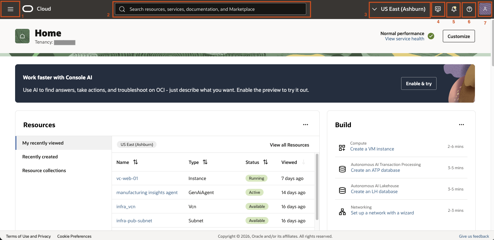

2. If you scroll down on the home page you will see a variety of dashboards. You have the ability to customize your home page to view the dashboards most important to you. Click **customize** on the top right to view available dashboards.

    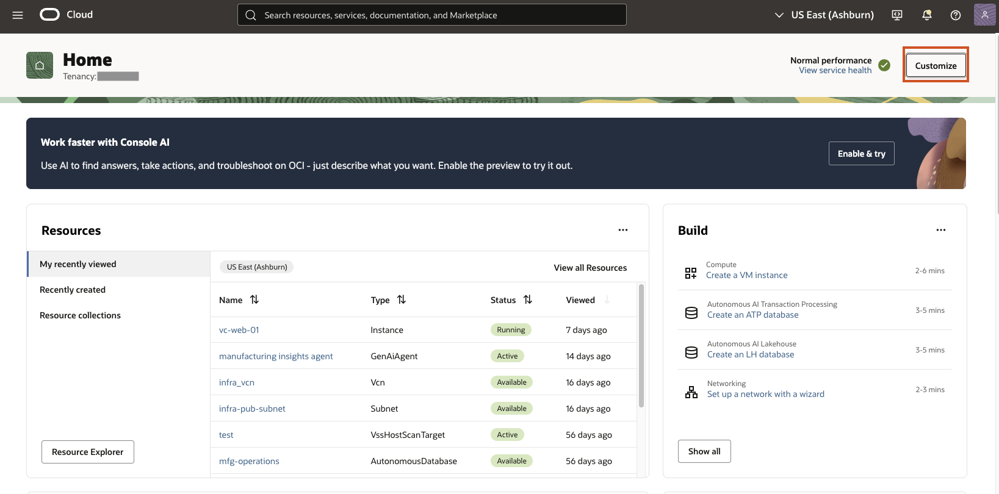

3. Take a look at the available dashboards that give you a quick overview of your cloud environment. Click **Cancel**.

    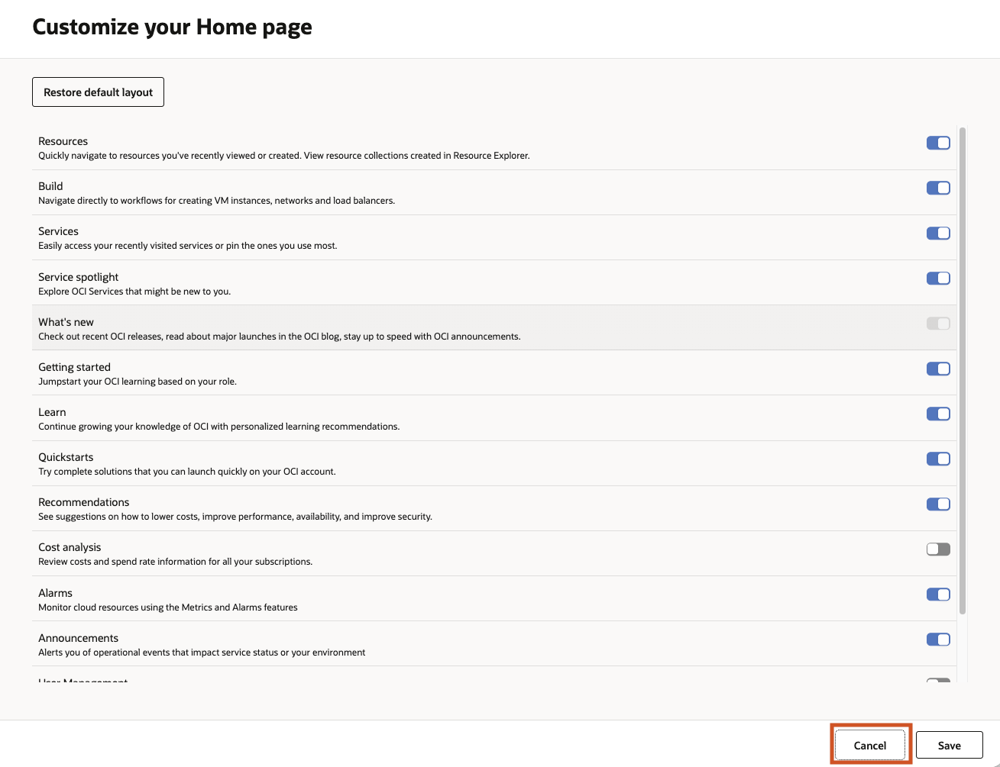

## Task 2: Explore Regions and Developer Tools

1. Click the **Regions** down arrow on the top of your screen. You should be able to see your home region as well as any other regions you are subscribed to. The home region is the default region assigned to your tenancy when you account is created. It is important because it is where your identity resources live and certain settings and configurations must be done there. Click **Manage Regions** at the bottom.

    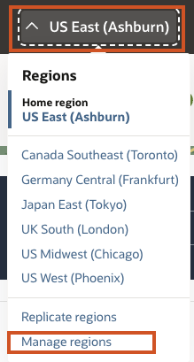

2. This page allows you to view and control which regions are currently active for your account. You can see which regions you are subscribed to and subscribe to more here.

    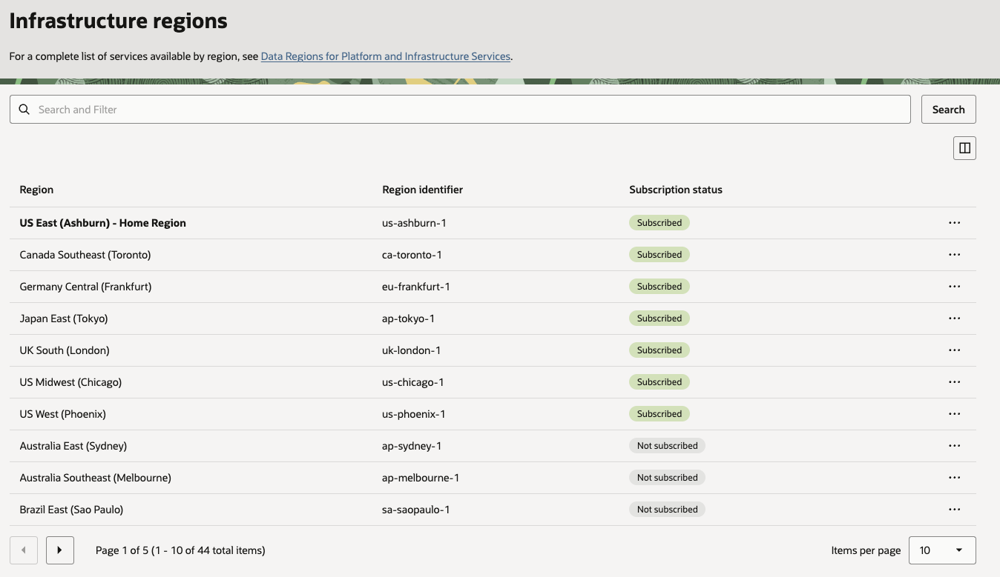

3. From this page, click the developer tools icon and click cloud shell.

    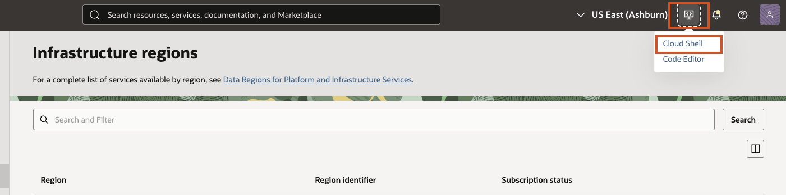

4. It may take a few minutes to load. Click the developer tools icon again and choose code editor to open up both.

    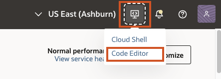

5. Once both are open click the actions menu on the top left and change the view to tabs. 

    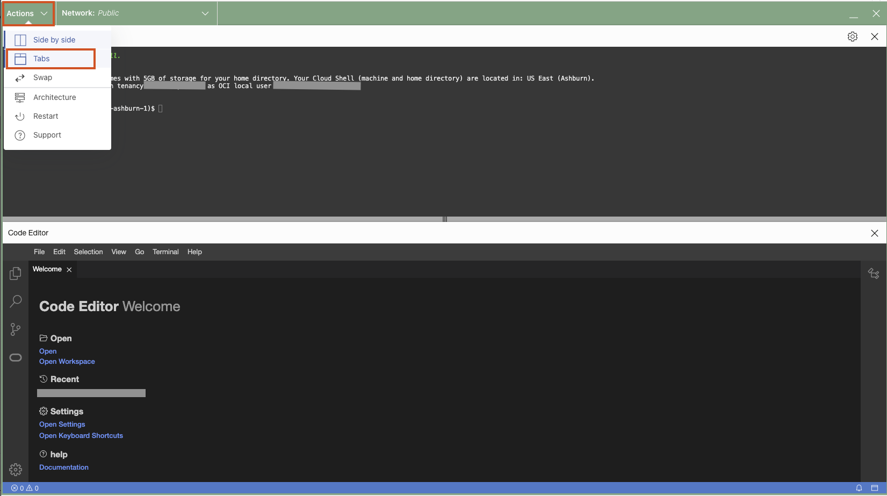

    You screen should now look like this.

    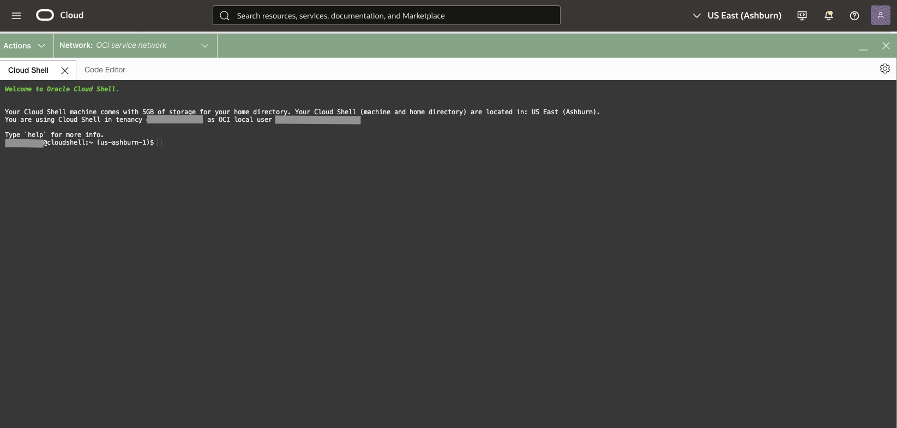

    **Cloud Shell** is a command-line interface with preinstalled tools like the OCI CLI, Git, and Terraform, along with persistent storage for your files. The **Code Editor** complements this by offering a graphical interface (similar to VS Code) where you can write, edit, and manage code. Together, they enable you to develop, test, and manage OCI resources efficiently from a single, integrated environment.

6. Click Actions Button again and select Architecture

    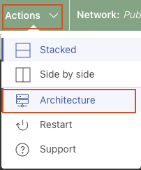

7. You cloud shell is running on a temporary compute environment. You are able to select your preferred architecture for this instance depending on what commands you may be running in cloud shell. Click **Cancel** 

    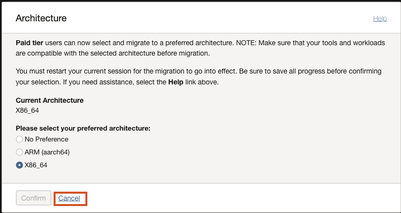

8. Next to actions button in cloud shell, click on the **down arrow next to Network: Public**. This allows you to toggle how you Cloud Shell session connects to oci resources. The Cloud Shell OCI Service Network allows you to access OCI wide services without providing access to the public internet Cloud Shell Public Network allows access to the public Internet from your Cloud Shell session.

    > _Note: Your administrator must configure access to the Cloud Shell Public Network using an Identity policy._

    Cloud Shell Private Networking allows you to connect a Cloud Shell session to a private network so you can access resources in your private network without having the network traffic flow over public networks. This option requires proper network setup (VCNs, subnets, security rules etc). You can choose between an ephemeral network setup for that session or define a definition list to choose from. 

    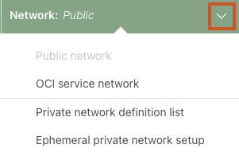

9. Click the **Code Editor Tab** and click the **Explorer** icon on the left sidebar. Under your username you will be able to view all directories you have created and files under them. Having and IDE environment helps when editing large files and maintain directories as you manage your resources. 

    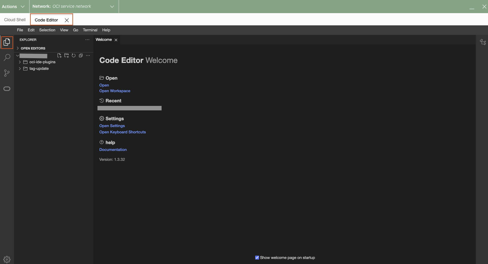

10. Notice the rest of the icons on the side bar to the left.

    - **Explorer (1):** Direct integration with Cloud Shell allows you to read and edit code files stored in the Cloud Shell home directory and have direct access to the 30+ cloud-based tools pre-installed with Cloud Shell. 
    - **Search (2):** Search allows you to search for text across files in your workspace.
    - **Source Control (3):** Git integration that enables you to clone any Git-based repository, track changes made to files, and commit, pull and push code directly from within the Code Editor, allowing you to contribute code and revert code changes with ease.
    - **Extensions (4):** Managed OCI service plug-ins that provide a native, integrated experience for supported OCI services, offering specific functionality and coding workflows for each supported service. For example, the Functions plugin allows developers to edit deploy and invoke functions from within the Code Editor window.

        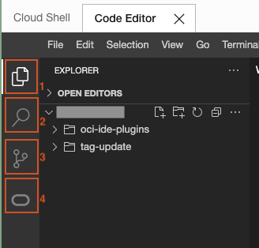

11. Click the **X** in top right corner to exit out of Developer tools.

    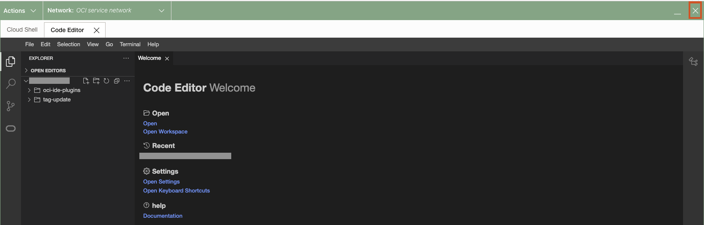

12. Confirm you want to exit by clicking **exit**.

    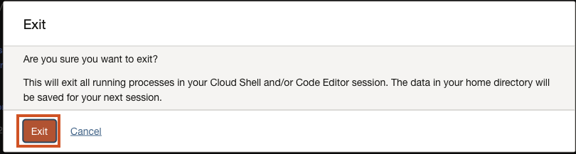

## Task 3: View Announcements and Help

1. Click the announcements icon in top bar of home screen

    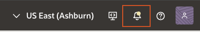

2. When you first view announcements page you will be able to view highlights for required actions, scheduled maintenance and others. On the left under _List Scope_ you can view the compartment you are interested in. You can leave the default for now. On the left side under Overview, click **Announcements**

    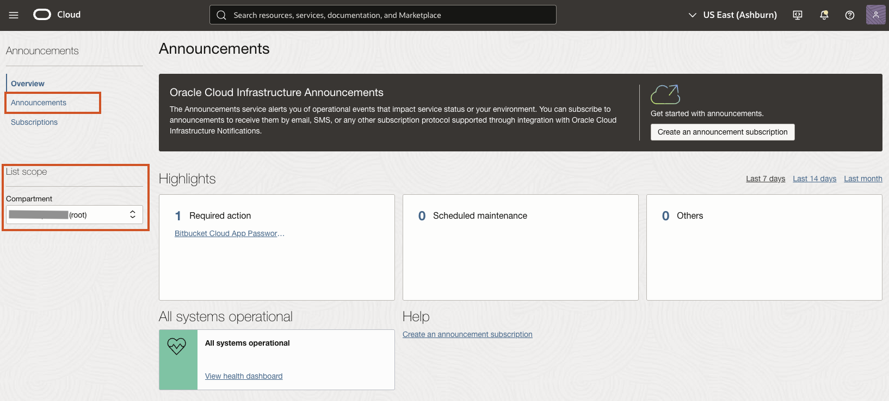

3. Here is where you can see a centralized view of important updates and notifications related to Oracle Cloud services. Announcements can include **service updates, maintenance notices, service disruptions** and **general notifications**. You are able to see the read status, reference ticket number, and service the announcement pertains to. You also have the ability to filter announcements by service, region, or type.

    When you click into an announcement you can see more details about the announcement and take actions like subscribing to an announcement. You can create announcement subscriptions to receive only announcements that you consider relevant. 

    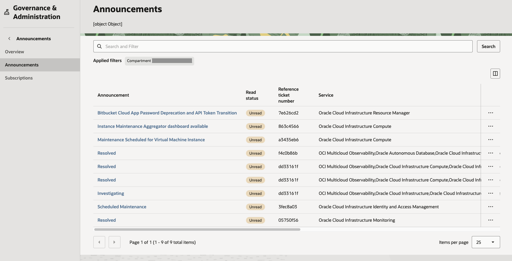

4. Click Oracle Cloud Icon on the top left on your screen to navigate back to the homepage.

    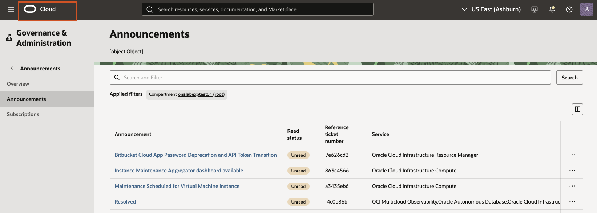

5. Click the Help Icon on the upper right corner of your screen. This button provides quick access to essential support and learning resources. From this menu, you can **access official documentation, step-by-step tutorials,** and **getting started guides**. It also allows you to **create and manage support requests, resource limit increase requests,** and **explore community forums.** Overall, it serves as a central place to find help, troubleshoot issues, and learn how to use OCI effectively.

    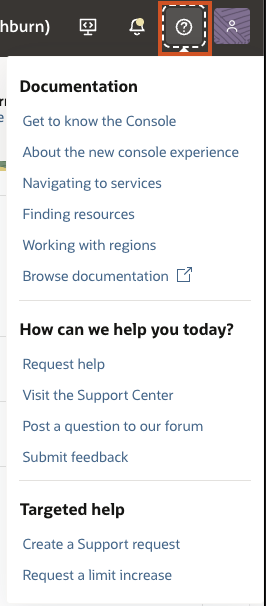

## Task 4: User Profile Button

1. Click the **User Icon** in the top right corner. The profile button provides access to your user account and tenancy information. From this menu, you can view details such as your **user settings**, **tenancy name**, as well as **manage preferences**, switch tenancies (if applicable), and **sign out**. It serves as the central place for managing your identity and account-related settings in OCI.

    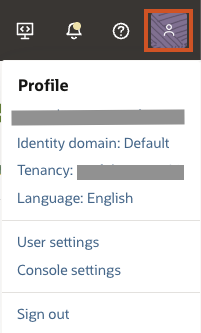

2. Click your username to go into user details page.

    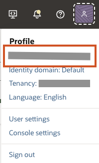

3. The User page in OCI displays detailed information about your individual account and allows you to manage your personal settings. On this page, you can view your user details such as your **OCID**, **group memberships**, and **permissions**, as well as manage **API keys**, **authentication tokens**, and **SSH keys** for secure access to OCI resources. It also provides options to **update your password** and **configure multi-factor authentication (MFA)**. The **Edit Profile** button allows you to update your personal account details, such as your **name**, **email preferences**, and other **user-specific settings**. 

    Take a moment to click through some of the options on the page to see how you can securely manage your user account. 

    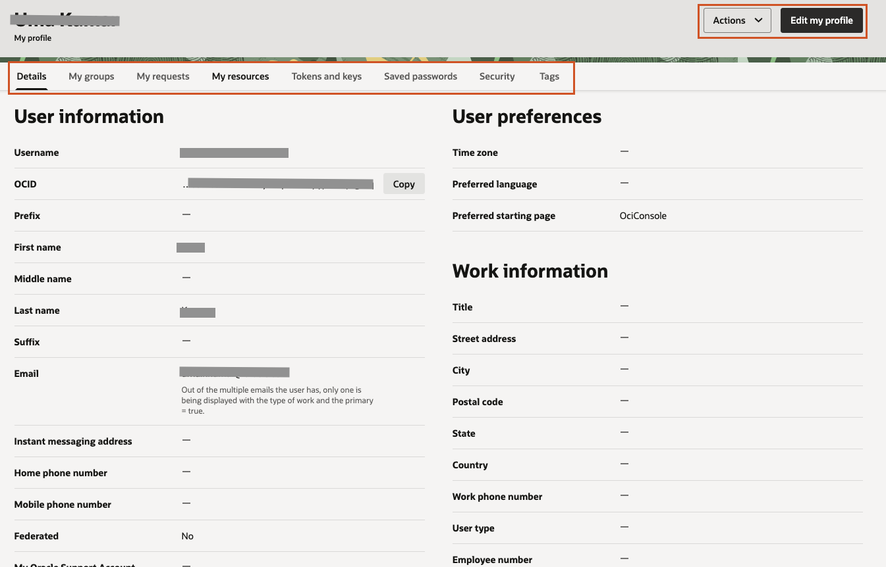

4. Click the User Icon button in the top right again and now select your tenancy.

    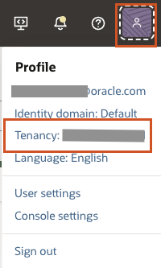

5. The **Tenancy Details** page in OCI provides an overview of your organization’s cloud account (tenancy) and its key identifiers. Here, you can find important information such as the **tenancy name**, **OCID**, **home region**, and **object storage namespace**. You can edit object storage settings, request deletion of tenancy, or rename tenancy **if** you have administrator permissions. 

    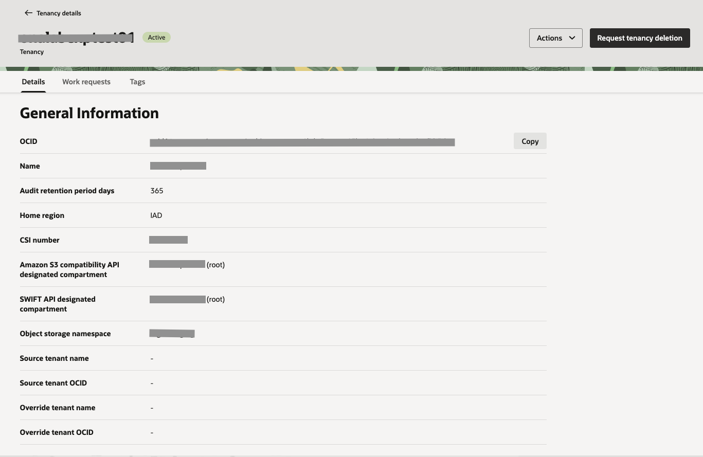

_Congratulations! You have successfully completed the lab._

## Acknowledgements

- **Author** - Uma Kumar
- **Last Updated By/Date** - Uma Kumar, April 2026