# Introduction to Observability and Management

## Introduction

In this lab we go over all the necessary steps to use the OCI logging service & Log Search Console Viewer to ingest, manage and analyze the logs generated by the Cloud Infrastructure.

The Oracle Cloud Infrastructure Logging service is a highly scalable and fully managed single pane of glass for all the logs in your tenancy. Logging provides access to logs from Oracle Cloud Infrastructure resources. These logs include critical diagnostic information that describes how resources are performing and being accessed.

Estimated Lab Time: 30 minutes


### About Product/Technology
Oracle Cloud Infrastructure (OCI) has introduced a fully managed Logging service which is a highly scalable log management and search platform that simplifies collecting, managing, and exploring your logs.


### Objectives

In this workshop, you will:
* Create a Log Group
* Enable a Network Flow Log
* Become familiar with the Log Search console.
* Search content from logs created in the preceding Labs.
* Export Log Content to an Object Storage Bucket.
* View the contents of the Bucket to verify data export.


### Prerequisites

* An Oracle Free Tier, Always Free, Paid or LiveLabs Cloud Account
* Access to the cloud environment and resources configured in Lab 1 

## Task 1: Create Log Group

Log groups are logical containers for organizing and managing logs. Logs must always be inside  a log group. You must first create a log group to enable or create logs.  Fortunately, this is a fast and easy activity.

1. In the OCI Management Console, ensure you have selected the same Region as Lab 1.  Navigate to **Observability & Management** --> **Log Groups**

      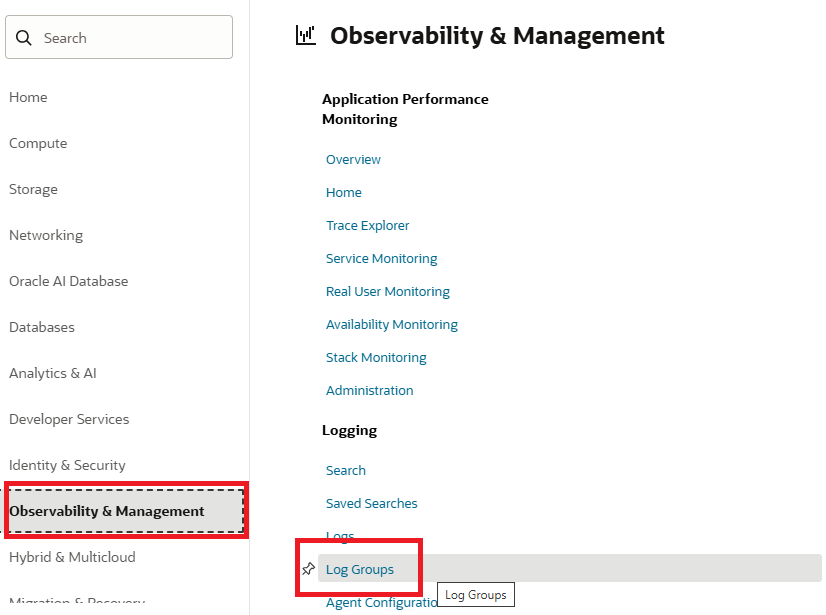

2. Ensure **Compartment** Demo is selected in the left column (the compartment you created in Lab 2).

    
   
3. Click the **Create Log Group** button.

    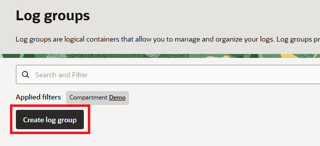

4. On the **Create Log Group** dialog page ensure **Compartment** Demo is specified.  **NAME** your Log Group LogServiceLg, provide a brief **DESCRIPTION**, and then click the **Create** button.

    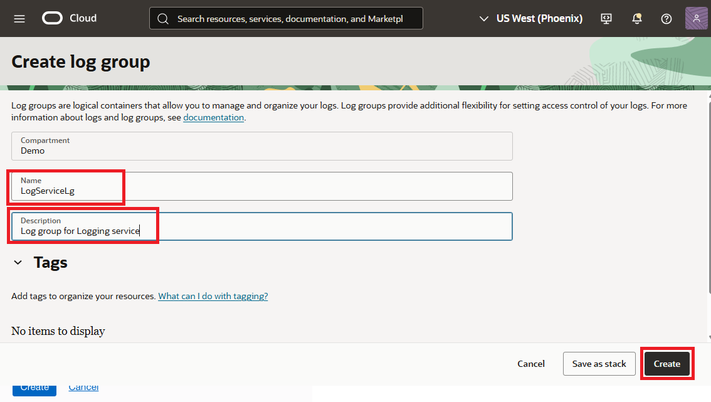

   
   You are now ready to move on to the next step.

## Task 2: Enable Network Flow Log

Many core cloud infrastructure services have built-in logging capabilities.  Now that you have created a Log Group in Step 1, let's select one of our core services and enable logging.  In this step, you will enable logging on the **Virtual Cloud Network** created in Lab 3.

1. To begin, you must first create a Capture Filter to define how much of the network traffic will be evaluated.  Use the navigation menut to access **Networking** -> **Capture filters**

    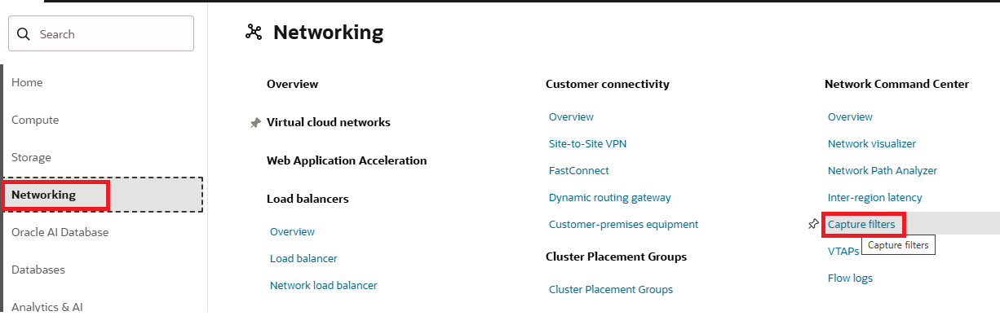

2. Click the **`[Create capture filter]`** button to open the dialog window.

    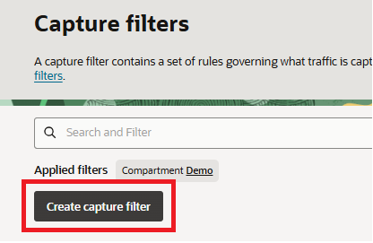

2. In the dialog window, enter or select the following values:

    - Provide a **Name** such as `Flowlogs-CaptureFilter`
    - Ensure **Compartment** Demo is selected
    - Ensure **Flow log capture filter** option is selected
    - Select a **Sampling rate** of 20%
    - For the **Source IPv4 CIDR** in Rule 1 enter `0.0.0.0/0`
    - For the **Destination IPv4 CIDR** in Rule 1 enter `0.0.0.0/0`

3. Click **`[Create capture filter]`**

    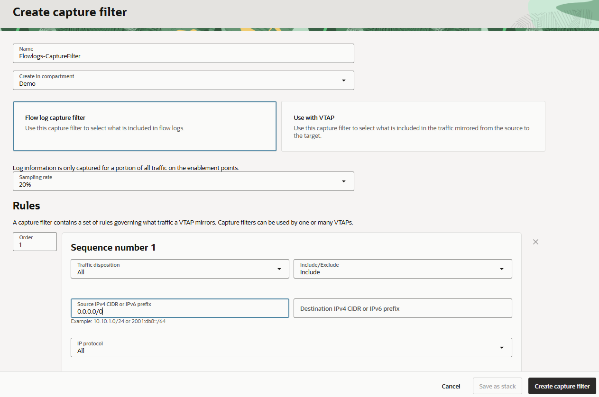

4.  Once the new Capture Filter status shows **Avaialble**, click the **Flow logs** navigation link in the left-hand Nav menu.

    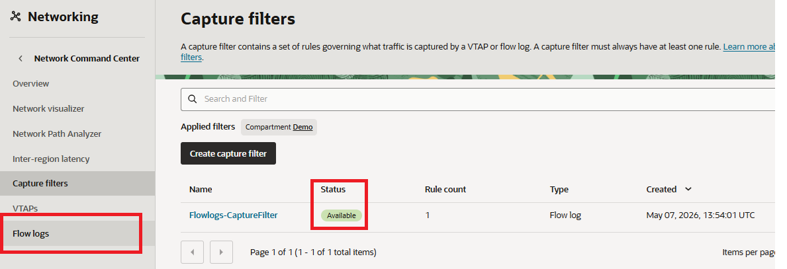

5. Click **`[Enable flow logs]`**

    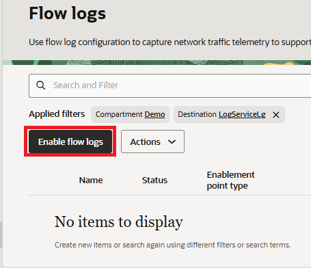

6. Fill in the requisite values:

    - Provide a **File name prefix**:
        ```<copy>logservicedemo</copy>```

    - Ensure **Log group** matches `LogServiceLg` that was created earlier
    - Ensure that **Capture Filter** value matches the Capture Filter created earlier `Flowlogs-Capture-Filter`

7. Click **`[Add enablement points]`**

8. In the pop-up dialog, click **`[Add enablement point]`** within the **Virtual cloud network** section, then select your Lab 3 VCN from the drop-down list.  Click the **`[Add enablement points]`** button in the lower right corner to continue.

    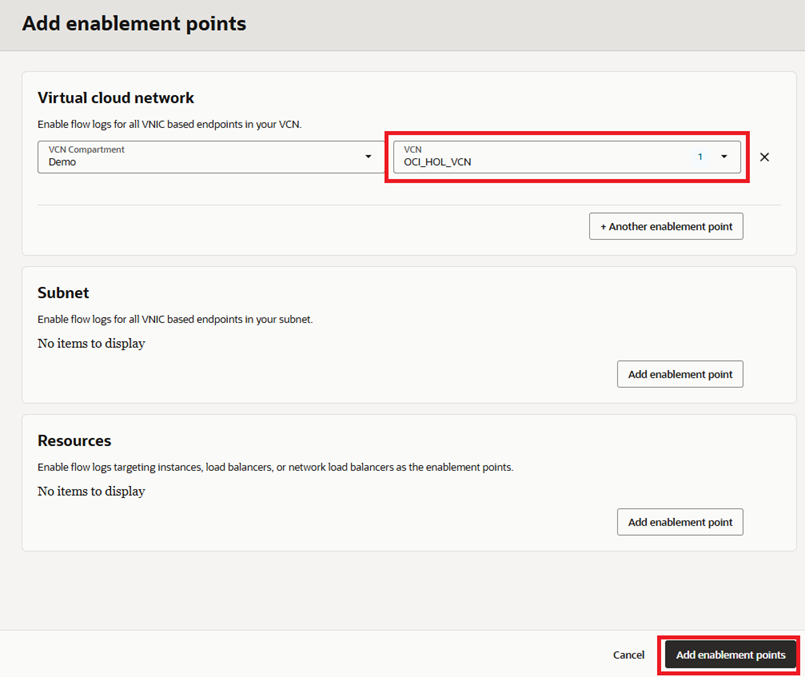

9. Click **`[Enable flow logs]`** to complete the setup and wait until **Status** becomes `Active`.


10. Now, use the navigation menu to return to **Observability & Management** -> **Logs**

    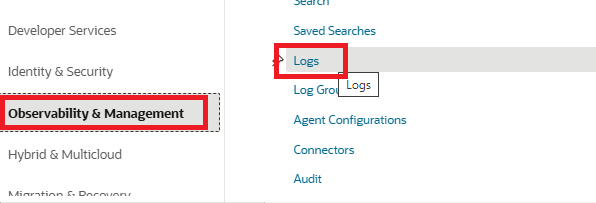


11. You should now see the **logservicedemo_1** resource that was just created. Click on the resource name to view details.

    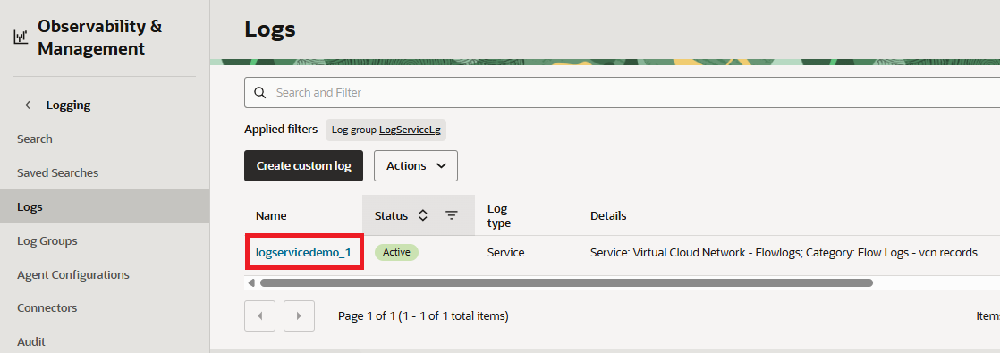

12. Click the **Explore log** tab.

    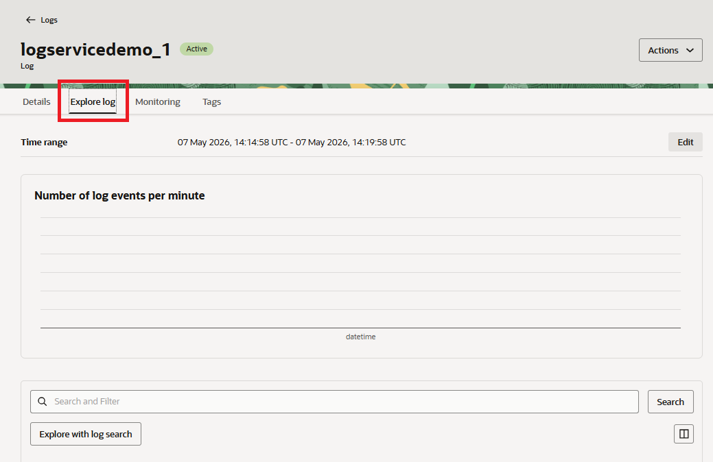

    >NOTE! It might take a few minutes to populate the log data. If it doesn't load right away, you may continue forward as we'll explore full log search activities in a later section.

## Task 3: Select Logs to be included in Search

1. Use the navigation menu to navigate to **Logging** --> **Search**.

    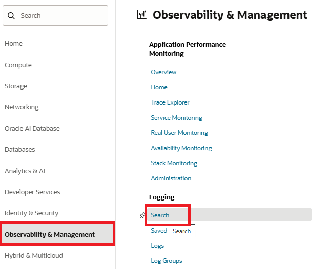

2. Click inside the **SELECT LOGS TO SEARCH** box to bring up the pop-up search panel.  

3.  Select Demo **COMPARTMENT**, LogServiceLg **Log Groups** and both the custom and service log listed in the **LOGS** section.

   This may take some time and a few extra clicks to become familiar with the log selection process.  In the end, your selection screen should look similar to the image below.  As long as **customlog01** and **servicelog01** are showing in the **SELECT LOGS TO SEARCH** box you're good to proceed.

    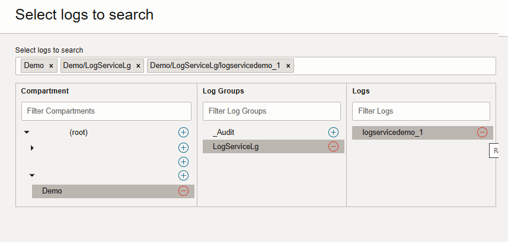

4.  Click **Continue** to close the panel and return to the search landing page.

5.  On the log search page, click the **Search** button and review the results in the panel below.  

6.  In the **FILTER BY FIELD OR TEXT SEARCH** box enter candidate search keywords such as "ERROR" or "REJECT".  View the results in the results panel.  

    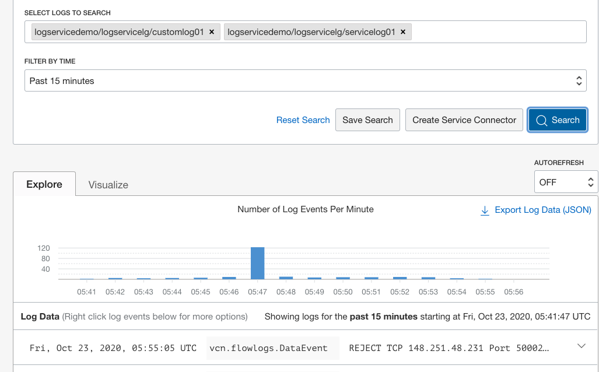

7.  Click the **Search** button an review the filtered results.

    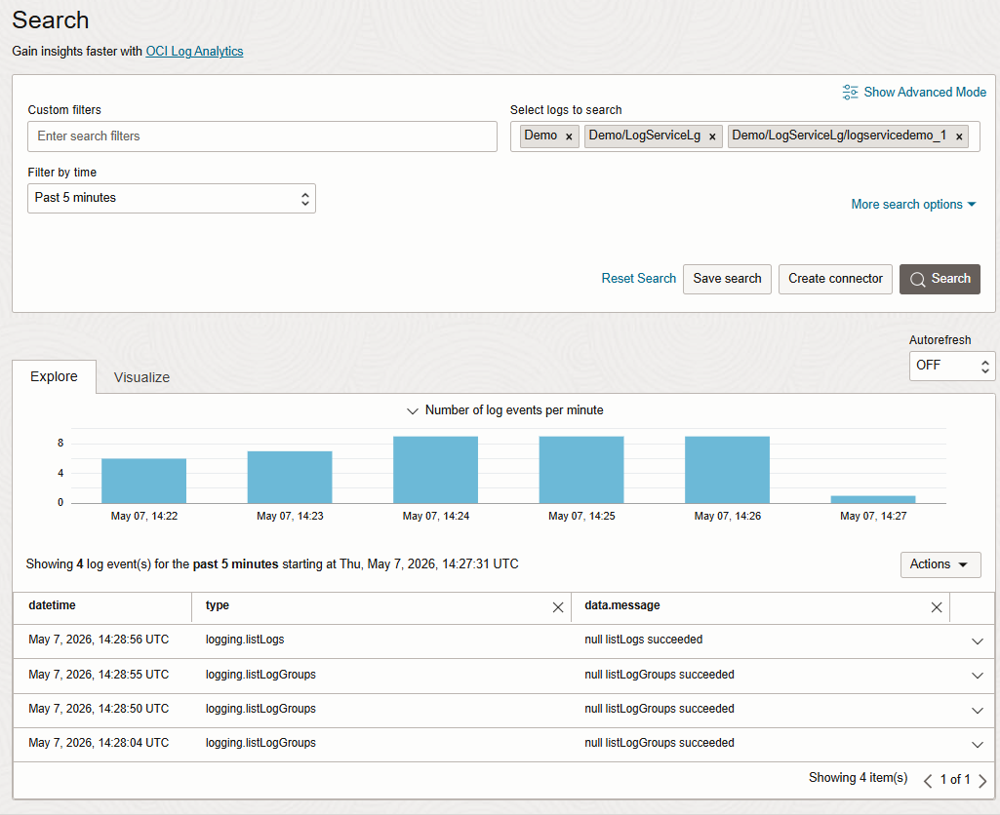


## Task 4: Configure Automated Export

In this step you will create a **Service Connector** to export Log content to the bucket you created in Lab 6.

1. In the OCI Management Console, navigate to **Analytics & AI** --> **Connector Hub**.

    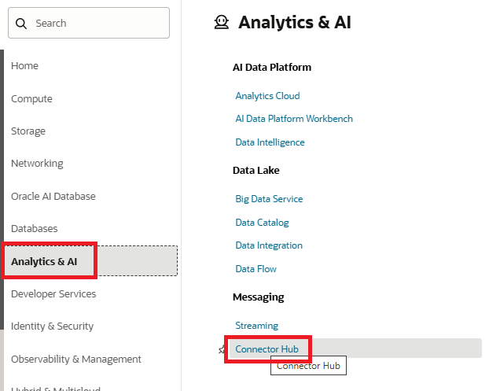

   
2. Ensure **Compartment** Demno is selected in the left column.  If this is the first time you have visited this page the **connectors** list will be empty.  Open the new connector panel by selecting **Create connector**.
    
    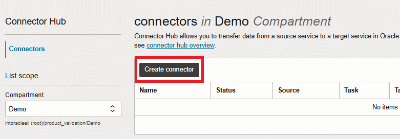

3. In the **Create connector** panel, enter `logdemoconnect` for **CONNECTOR NAME**, add a brief description, and double-check that Demo is specified for **RESOURCE COMPARTMENT**.

4. In the **Configure Service Connector** section:

    - select **Logging** for **SOURCE**
    - select **Object Storage** for **TARGET**
    - Choose **LogserviceLg** for **LOG GROUP**
    - choose **logservicedemo_1** for **LOGS**.  
    
    >Note: In this Lab we will not configure more advanced filtering and processing parameters.  Please refer to the **Learn More** section for links on getting started with advanced configurations.
    
    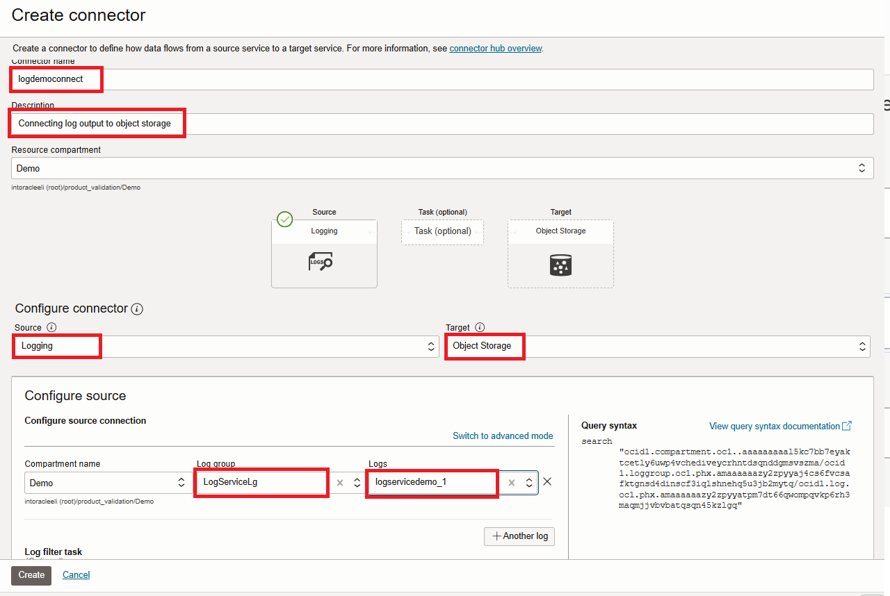

5. In the **Configure target connection** section, select the **BUCKET** you created in Lab 6: `bucket-demo`.

6. The Connector Service provides an option to automatically create the security policy (permissions) required for this connector job to export data.  Click **Create** in the box as shown in the image below.  **Note**: depending on your account type and previous setup steps, these permissions may have already been implicitly created.  In that case this option will not be presented and it's safe to proceed to the next item.
    
    - The box confirms the policy creation and displays the policy name for future reference.
    
    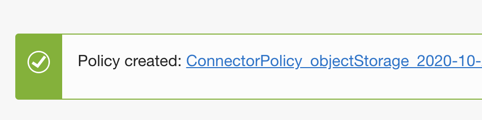

7. Click the **`[Create]`** button in the lower left corner to create the connector.
    
    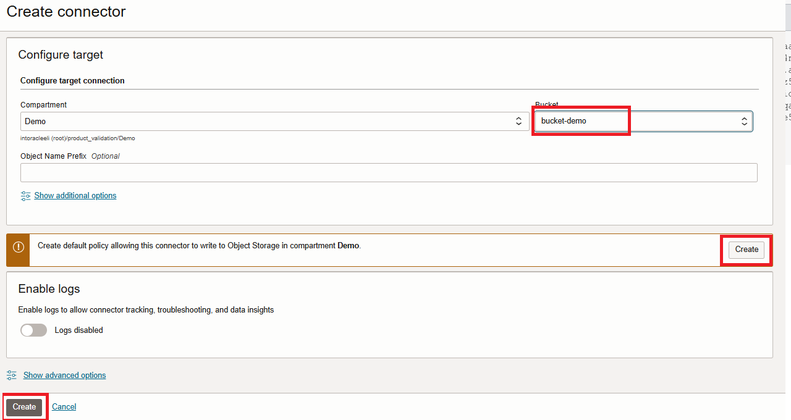

    >NOTE: The panel will close and then show the new connector properties page.  Here you may view/edit configurations and also verify the status of the data processing.  Log content is processed periodically in batches.  It may take a few minutes for activity and metrics to show in the console.

    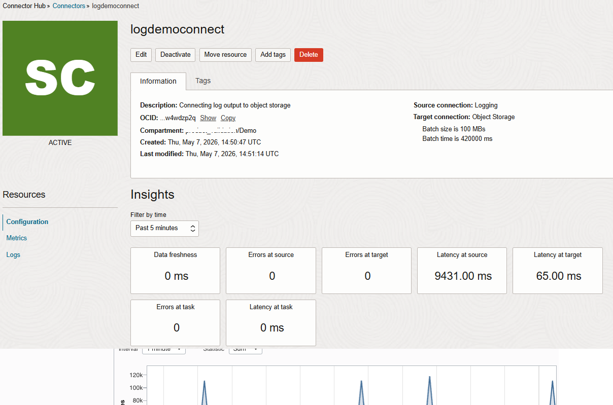

   
## Task 5: [Optional] View Log Archive Content

Log content archived to Object Storage is aggregated via batches (default every 7 minutes) and stored in .gz format. Timestamps allow easy retrieval by time range(s).  In this step you will locate archived content and optionally download/extract/view to validate the storage integrity.

1. Use the navigation menu to navigate to **Storage** -> **Buckets**, select **Compartment** Demo to locate the bucket created in Lab 6.

    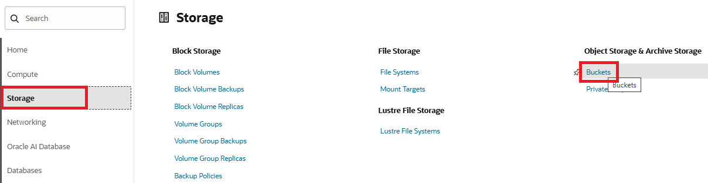

2. Click on the bucket name **bucket-demo** to open the properties page. Click the bucket name.

    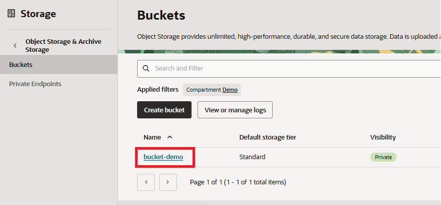

3.   Click the **Objects** tab to view archive content in timestamped gzip format.

    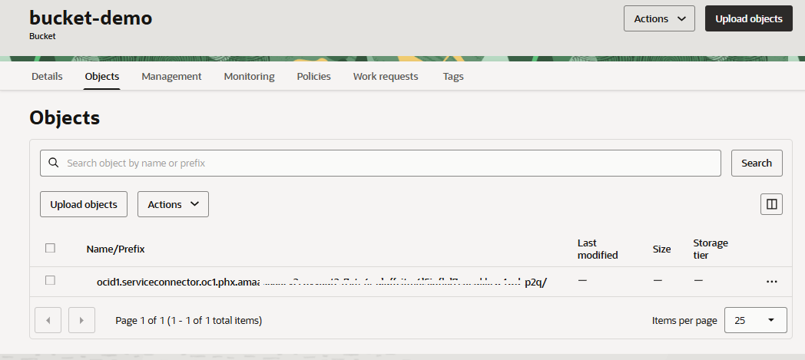


4. Select a file for download, extraction and viewing. The download option may be found by clicking the vertical dots in the far righthand column.  

    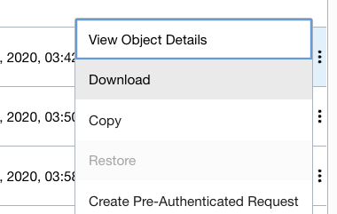

4. User your preferred log or text viewer to verify content.

    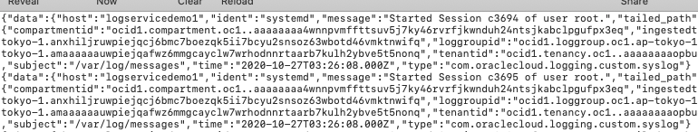


## Learn More

* [OCI Logging Service Overview](https://docs.cloud.oracle.com/en-us/iaas/Content/Logging/Concepts/loggingoverview.htm)


## Acknowledgements
* **Author** - Eli Schilling, Cloud Archtiect
* **Last Updated Date** - Eli Schilling, May 2026


