# Introduction to Observability and Management

## Introduction

In this lab we go over all the necessary steps to use the OCI logging service & Log Search Console Viewer to ingest, manage and analyze the logs generated by the Cloud Infrastructure.

The Oracle Cloud Infrastructure Logging service is a highly scalable and fully managed single pane of glass for all the logs in your tenancy. Logging provides access to logs from Oracle Cloud Infrastructure resources. These logs include critical diagnostic information that describes how resources are performing and being accessed.

Estimated Lab Time: 30 minutes

### About Product/Technology
Oracle Cloud Infrastructure (OCI) has introduced a fully managed Logging service which is a highly scalable log management and search platform that simplifies collecting, managing, and exploring your logs.

### Objectives

In this workshop, you will:
* Create a Log Group
* Enable a Network Flow Log
* Become familiar with the Log Search console.
* Search content from logs created in the preceding Labs.
* Export Log Content to an Object Storage Bucket.
* View the contents of the Bucket to verify data export.

### Prerequisites

* An Oracle Free Tier, Always Free, Paid or LiveLabs Cloud Account
* Access to the cloud environment and resources configured in Lab 1 

## Task 1: Create Log Group

Log groups are logical containers for organizing and managing logs. Logs must always be inside  a log group. You must first create a log group to enable or create logs.  Fortunately, this is a fast and easy activity.

1. In the OCI Management Console, ensure you have selected the same Region as Lab 1.  Navigate to **Logging** --> **Log Groups**

      

2. Ensure **Compartment** logservicedemo is selected in the left column.

    
   
3. Click the **Create Log Group** button.

    

4. On the **Create Log Group** dialog page ensure **Compartment** logservicedemo is specified.  **NAME** your Log Group logservicelg, provide a brief **DESCRIPTION**, and then click the **Create** button.

    

   
   You are now ready to move on to the next step.

## Task 2: Enable Network Flow Log

Many core cloud infrastructure services have built-in logging capabilities.  Now that you have created a Log Group in Step 1, let's select one of our core services and enable logging.  In this step, you will enable logging on the **Virtual Cloud Network** created in Lab 1.

1.  Select **Logs** in the left column of the OCI Management Console.  This can be found in the **Logging** service in case you no longer have that page open. 

    

2.  Select **Enable Service Log** to open the Enable Resource Dialog page.  

    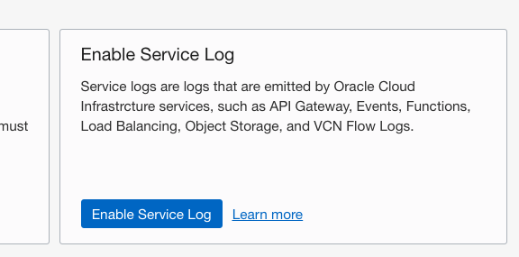

3.  On the **Enable Resource Log** page:
    - Ensure **Compartment** logservicedemo is listed
    - Choose **Virtual Cloud Network (subnets)** from the **Service** drop-down
    - Select **RESOURCE** logservicesub01
    - In the **Configure Log** section **Name** your log as shown in the image
    - Click **Enable Log** to complete the task

    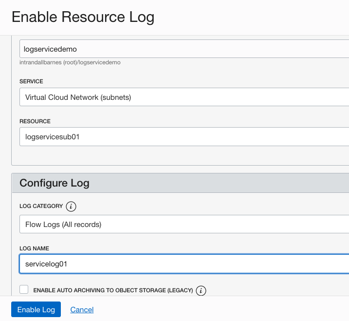

4.  Review the Log details page.  It may take a couple minutes for the service to complete configurations.

    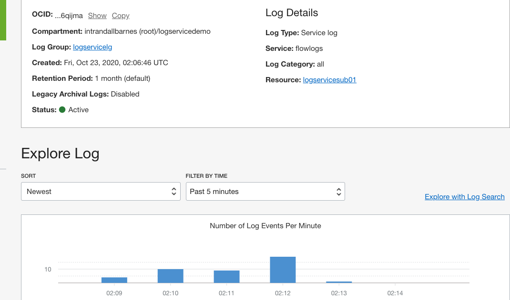

5.  You may explore log content directly from the Log properties page. Note: Full log search activities are covered in a later Lab section.

    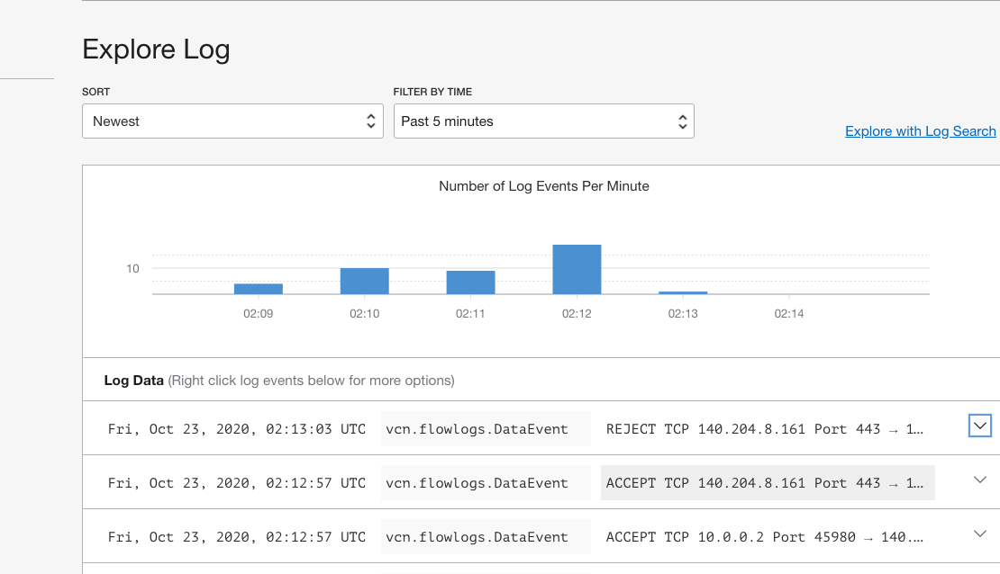

## Task 3: Select Logs to be included in Search

1. In the OCI Management Console, ensure you have selected the same Region as the previous Labs.  Navigate to **Logging** --> **Search**.

    

2. Click inside the **SELECT LOGS TO SEARCH** box to bring up the pop-up search panel.  

3.  Select logservicedemo **COMPARTMENT**, logservicelg **Log Groups** and both the custom and service log listed in the **LOGS** section.

   This may take some time and a few extra clicks to become familiar with the log selection process.  In the end, your selection screen should look similar to the image below.  As long as **customlog01** and **servicelog01** are showing in the **SELECT LOGS TO SEARCH** box you're good to proceed.

  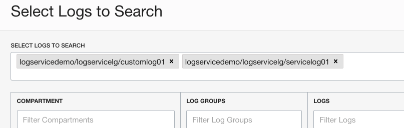

  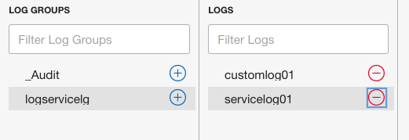

4.  Click **Continue** to close the panel and return to the search landing page.

## Task 4: Search Content and Explore Logs

1.  On the log search page, click the **Search** button and review the results in the panel below.  

2.  In the **FILTER BY FIELD OR TEXT SEARCH** box enter candidate search keywords such as "ERROR" or "REJECT".  View the results in the results panel.  

  

3.  Click the **Search** button an review the filtered results.

4.  **Optional**: Update the search parameters to filter the results.

## Task 5: Create Object Storage Archive Bucket

The target bucket must already exist prior to creating the service connector, so let's create a bucket now.

1.  In the OCI Management Console, ensure you have selected the same region where you have created the resources from the previous Labs in this workshop.  Navigate to the Object Storage service.

    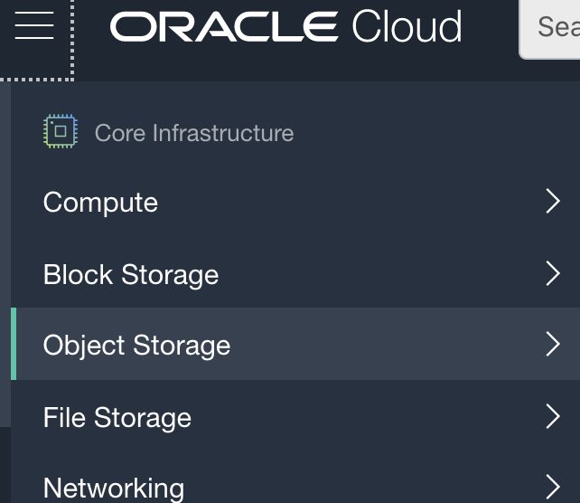

2.  In the Object Storage service landing page, ensure your scope is set to **Compartment** logservicedemo.
    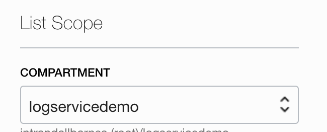

3.  Click on **Create Bucket** to bring up the create bucket panel.
    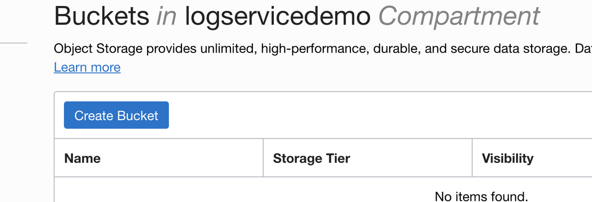

4.  In the **Create Bucket** panel, enter **BUCKET NAME** logarchivedemo, **STORAGE TIER** Standard, leave **OBJECT EVENTS** and **OBJECT VERSIONING** deselected, and ensure **ENCRYPTION** is configured to ENCRYPT USING ORACLE MANAGED KEYS as shown in the following image.
    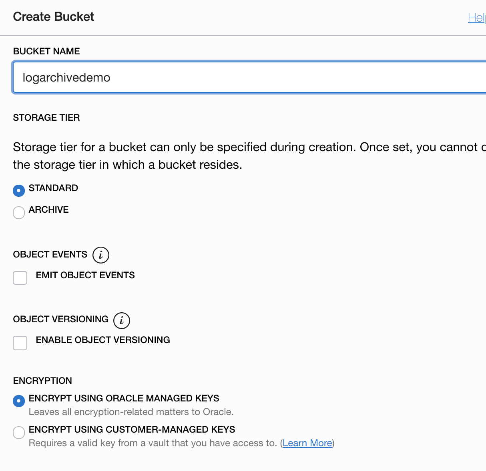

5.  Click **Create Bucket** to complete the new bucket creation task, and you're ready to move on to the next step.

## Task 6: Configure Automated Export

In this step you will create a **Service Connector** to export Log content to the bucket you created in Step 1.

1. In the OCI Management Console, navigate to **Logging** --> **Service Connectors**.

    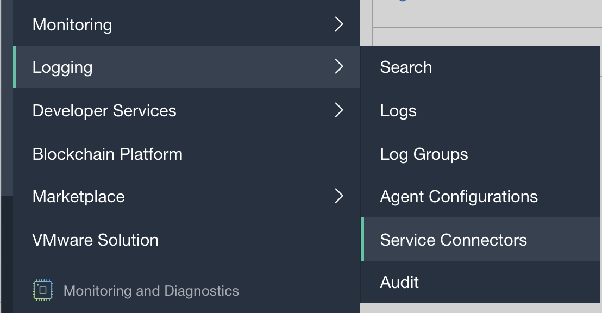

   
2. Ensure **Compartment** logservicedemo is selected in the left column.  If this is the first time you have visited this page the **Service Connector** list will be empty.  Open the new connector panel by selecting **Create Connector**.
    
    

3. In the **Create Service Connector** panel, enter logdemoconnect for **CONNECTOR NAME**, add a brief description, and double-check that logservicedemo is specified for **RESOURCE COMPARTMENT**.
    
    

4. In the **Configure Service Connector** section, select **Logging** for **SOURCE** and **Object Storage** for **TARGET**.  Choose **Logservicelg** for **LOG GROUP**  and **customlog01** for **LOGS**.  In this Lab we will not configure more advanced filtering and processing parameters.  Please refer to the **Learn More** section for links on getting started with advanced configurations.
    
    

5. In the **Configure target connection** section, select the **BUCKET** you created in Step 1: logarchivedemo.    
    
    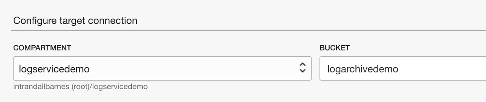

6. The Connector Service provides an option to automatically create the security policy (permissions) required for this connector job to export data.  Click **Create** in the box as shown in the image below.  **Note**: depending on your account type and previous setup steps, these permissions may have already been implicitly created.  In that case this option will not be presented and it's safe to proceed to the next item.
    
    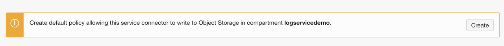

   The box confirms the policy creation and displays the policy name for future reference.
    
    

7. Complete the connector creation task by clicking **Create**

    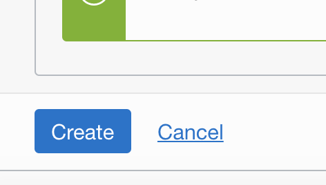

   The panel will close and then show the new connector properties page.  Here you may view/edit configurations and also verify the status of the data processing.  Log content is processed periodically in batches.  It may take a few minutes for activity and metrics to show in the console.

    

   
## Task 7: [Optional] View Log Archive Content

Log content archived to Object Storage is aggregated via batches (default every 7 minutes) and stored in .gz format. Timestamps allow easy retrieval by time range(s).  In this step you will locate archived content and optionally download/extract/view to validate the storage integrity.

1. Navigate to **Object Storage**, select **Compartment** logservicedemo to locate the bucket created in Step 1.

    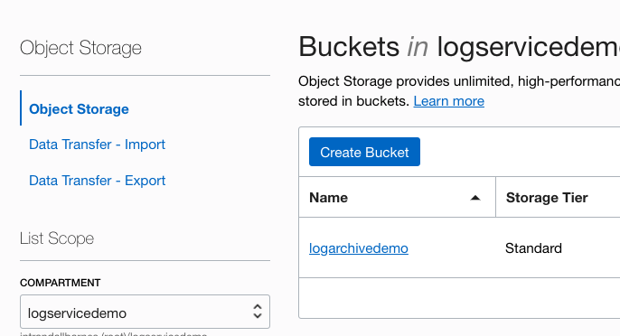

2. Click on the bucket name **logarchivedemo** to open the properties page.  Expand the bucket contents to view archive content in timestamped gzip format.  **Note: it may take a few minutes after creating the connector for initial content to land in the bucket**. 

    

3. Select a file for download, extraction and viewing. The download option may be found by clicking the vertical dots in the far righthand column.  

    

4. User your preferred log or text viewer to verify content.

    

## Learn More

* [OCI Logging Service Overview](https://docs.cloud.oracle.com/en-us/iaas/Content/Logging/Concepts/loggingoverview.htm)

## Acknowledgements
* **Author** - Eli Schilling, Cloud Archtiect
* **Last Updated Date** - Eli Schilling, May 2026

