# Create Virtual Cloud Networks

## Introduction

Oracle Cloud Infrastructure (OCI) Compute lets you create multiple Virtual Cloud Networks (VCNs). These VCNs will contain security lists, compute instances, load balancers and many other types of network assets.

Be sure to review [Overview of Networking](https://docs.cloud.oracle.com/iaas/Content/Network/Concepts/overview.htm) to gain a full understanding of the network components and their relationships, or take a look at this video:

Estimated Time: 15 minutes

Here is an instructional video, going through the process of making a VCN:

### Objectives

In this lab, you will:

- Explore how to create a virtual cloud network

- Explore Public and Private Subnets

- Explore the different gateways: Internet, NAT, Service

- Explore Route Tables

- Explore Security Lists & Network Security Groups

### Prerequisites

- An Oracle Cloud Account - please view this workshop's LiveLabs landing page to see which environments are supported.

>**Note:** If you have a **Free Trial** account, when your Free Trial expires, your account will be converted to an **Always Free** account. You will not be able to conduct Free Tier workshops unless the Always Free environment is available.

**[Click here for the Free Tier FAQ page.](https://www.oracle.com/cloud/free/faq.html)**

## Task 1: Create Your VCN using the Wizard

    <if type="livelabs">
**You are running this workshop in a LiveLabs environment. Our LiveLabs environments use a pre-configured Virtual Cloud Network (VCN), so you will not create a VCN in this workshop.** However, you can see how a VCN is created in Oracle Cloud Infrastructure by watching this short video:

 
 </if>

    <if type="freetier">
To create a VCN on Oracle Cloud Infrastructure:

1. On the Oracle Cloud Infrastructure Console Home page, under the **Launch Resources** header, click **Set up a network with a wizard**.

    

2. Click the **Actions** dropdown and select **Start VCN Wizard**.

    

3. Select **Create VCN with Internet Connectivity**, and then click **Start VCN Wizard**.

    

4. Complete the following fields:

    |**Field**|**Value**|
    |----------------------------------------|:------------:|
    |VCN Name|OCI\_HOL\_VCN|
    |Compartment|Choose the ***Demo*** compartment you created in the ***Identity and Access Management Lab***
    |VCN CIDR Block|10.0.0.0/16|
    |Public Subnet CIDR Block|10.0.0.0/24|
    |Private Subnet CIDR Block|10.0.1.0/24|
    |Use DNS Hostnames In This VCN|Checked|

    Your screen should look similar to the following:

    

     Click the **Next** button at the bottom of the screen.

5. Review your settings to be sure they are correct. Click the **Create** button to create the VCN.
    

6. It will take a moment to create the VCN and a progress screen will keep you apprised of the workflow.

    

7. Once you see that the creation is complete (see previous screenshot), click the **View Virtual Cloud Network** button.
</if>

## Task 2: Public and Private Subnets

Within a VCN, you have subnets. Subnets are subdivisions of a VCN. Each subnet in a VCN consists of one or more contiguous range of IPv4 addresses and optionally IPv6 addresses that don't overlap with other subnets in the VCN. Subnets act as a unit of configuration comprised of: a route table, security lists, and DHCP options. Subnets can either be public or private. We will go over each type in this task.

### **Public Subnets**

When you create a subnet, by default it's considered public, which means instances in that subnet are allowed to have public IPv4 addresses and internet communication is permitted with IPv6 endpoints. In order to connect to the internet, you must use an Internet Gateway which will enable inbound and outbound internet connectivity when security rules allow it. Some use cases for using public subnets include web servers, external load balancers, public-facing bastion hosts.

### **Private Subnets**

Private subnets does not allow public IP assignment to instances. Resources typically have only private IPs and are isolated from direct inbound internet access. Private subnets can still reach the internet for updates or outbound calls using a NAT Gateway (egress-only) or use a Service Gateway to access OCI services (like Object Storage) privately without traversing the public internet.

### **Public VS. Private Subnets**

| Feature | Public Subnet | Private Subnet |
| :-------- | :------------: | :-------------: |
| Internet Connectivity | direct via Internet Gateway | no direct internet access |
| Public IP Support | Instances can have public IPs | no public IPs assigned |
| Inbound Traffic from Internet | allowed (with security rules) | not allowed |
| Outbound Internet Access | direct access | required NAT Gateway |
| Security Exposure | higher (internet facing) | lower (isolated, internal only) |

### Creating a Subnet

1. To create subnets, navigate to the Subnet tab for your VCN. Click **Create Subnet**.
    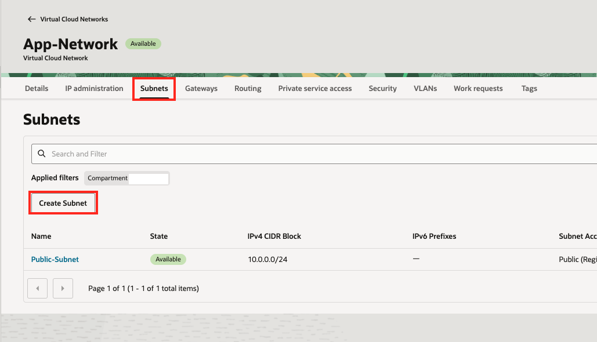

2. You will need to provide specifications for your subnet including name, compartment, regional or AD specific, IPv4 CIDR, public or private, DNS details, and optionally, associating security lists or enabling logging.
    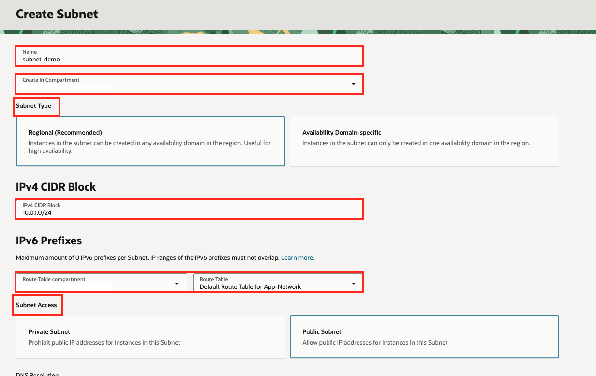

    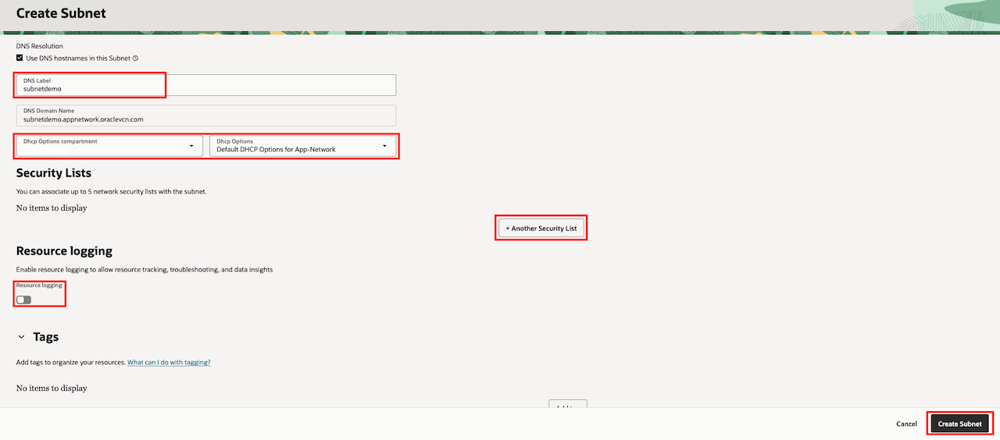

Once you've filled out these specifications, your subnet will be created.

## Task 3: Different OCI Gateways: Internet, NAT, Service

Think of OCI gateways as different kinds of “doors” your cloud network (VCN) can use to reach other places. Each door has a specific purpose. In this lab, we will cover Internet, NAT, and Service gateways. These gateways are not a security control by itself—routes + security rules determine what actually gets through.

### **Internet Gateways**

An Internet Gateway in OCI is like the main door from your cloud network (VCN) to the public internet. You typically use an Internet Gateway for public subnets. If your subnet’s route table says “send internet traffic to the Internet Gateway,” and your instance has a public IP, then it can talk to the internet. It can also receive traffic from the internet, but only if you allow it with security rules (NSGs/security lists) and the instance/OS permits it.

### **NAT Gateways**

A NAT Gateway in OCI is like a one-way exit door from a private neighborhood. Your instances in a private subnet don’t have public IPs, so they can’t be reached directly from the internet.
But they still might need to go out to download updates, pull packages, or call an external API. The NAT Gateway lets them start connections out to the internet, and it “remembers” the connection so the replies can come back. People on the internet can’t start a new connection into your private instances through the NAT Gateway.

### **Service Gateways**

A Service Gateway in OCI is like a private tunnel from your VCN to Oracle’s cloud services (such as Object Storage), so your traffic doesn’t go out to the public internet. Your instances (often in a private subnet) can reach OCI services using private network paths. You don’t need public IPs, an Internet Gateway, or a NAT Gateway just to talk to those OCI services. It’s mainly for private, safer access to things like Object Storage, Autonomous Database endpoints.

### **Comparing Gateways**

| Feature | Internet | NAT | Service |
| :-------- | :--------: | :--------: | :-------: |
| Connectivity Type | public internet access (bi-directional) | outbound-only internet access | private access to OCI services |
| Public Exposure | exposes resources to the internet | keeps resources private | fully private (no internet exposure) |
| Public IP Requirement | required | not required | not required |
| Traffic Direction | ingress + egress | egress only | egress only to OCI services |
| Target Destination | any internet destination | any internet destination | only OCI service endpoints |

### **Creating Gateways**

1. To create Gateways, navigate to the Gateways tab for your VCN. Here, you can create different Gateways to use.

    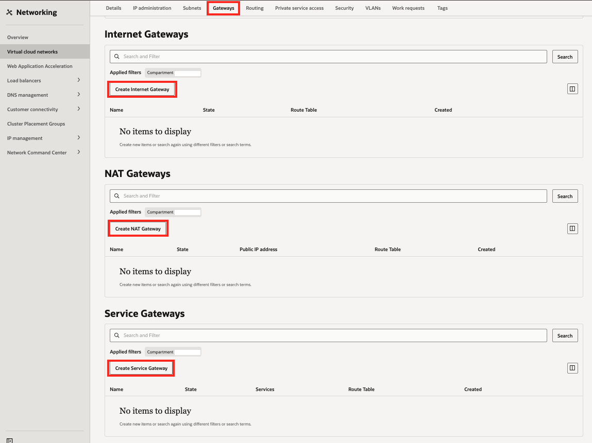

2. To create a Service Gateway, click Create Service Gateway. You will need to provide a name, compartment, and Service type for the resource.

    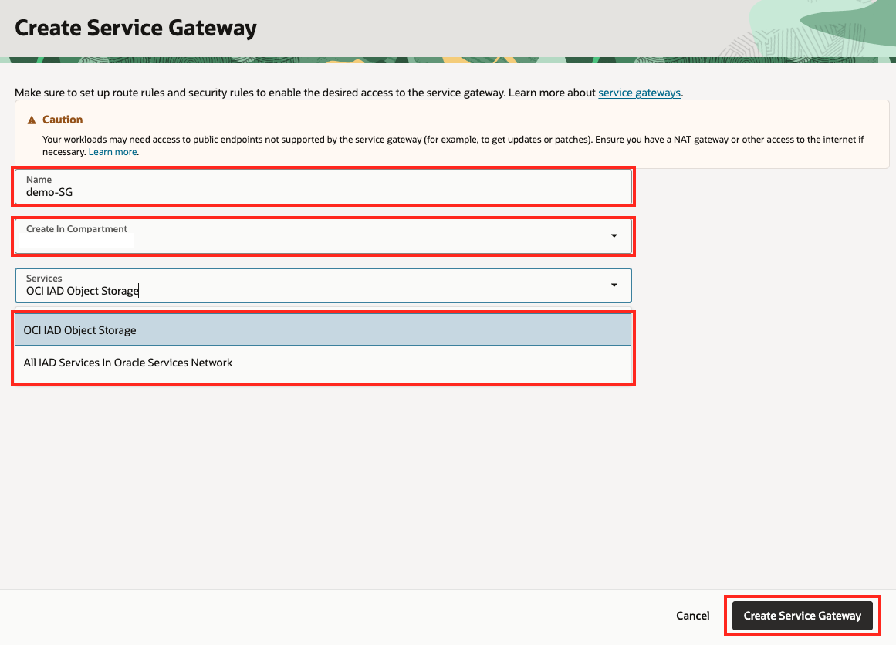

3. To create a NAT Gateway, click Create NAT Gateway. You will need to provide a name, compartment, and IP address type for the resource.

    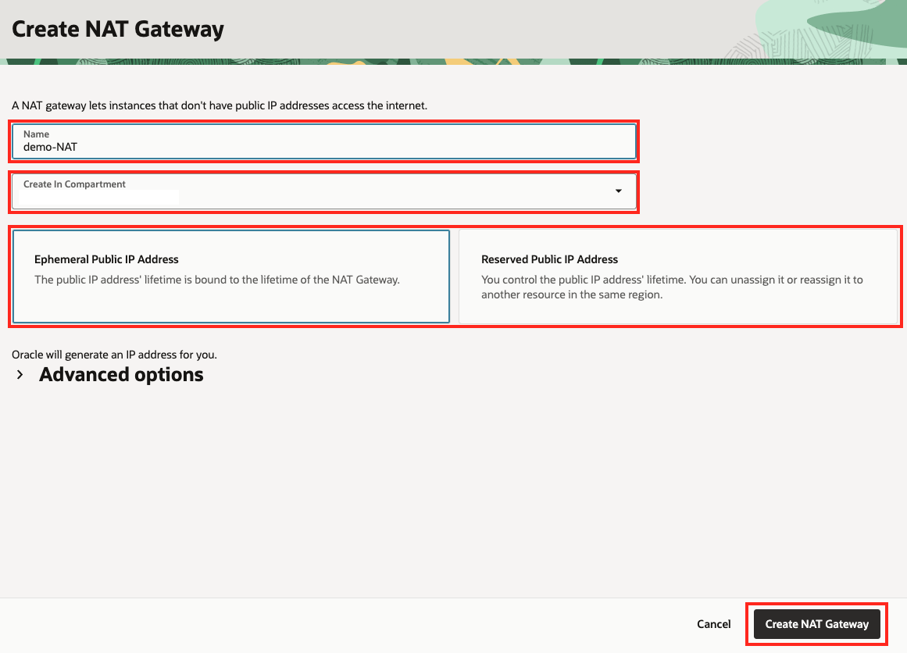

4. To create a Internet Gateway, click Create Internet Gateway. You will need to provide a name and compartment for the resource.
    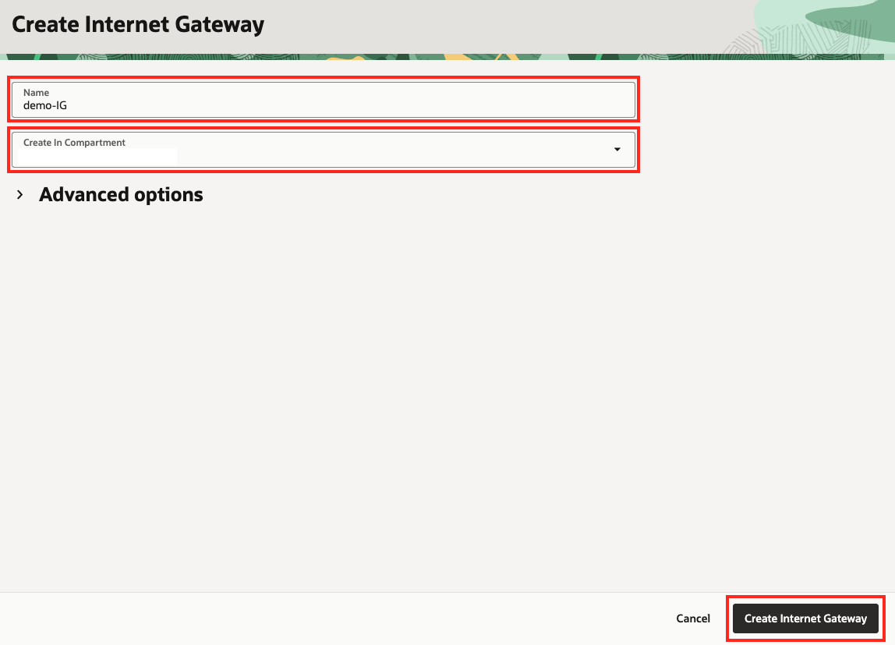

## Task 4: Route Tables

In OCI, a route table is like a set of traffic rules for your cloud network (VCN). It tells your resources (like servers): “If you want to send data somewhere, here’s where to send it.” For example, if you need to send data to the public internet, your route table will specify to send the data to the Internet Gateway. The route table does so through route rules.

Route rules determine the exact to send the data. You will need to set up route rules in your route table that specify where data is going depending on the destination. In a route rule, you will need to include the destination (where the traffic is going) in a CIDR block format, the target (typically a certain gateway or private IP), and a route table to attach the rule to.

You'll want to make sure that the CIDR does not overlap, otherwise routing gets weird and to make sure the target resource already exists.

### **Creating Route Tables and Route Rules**

1. To create Route Tables, navigate to the Routing tab for your VCN. Click **Create Route Table**.
    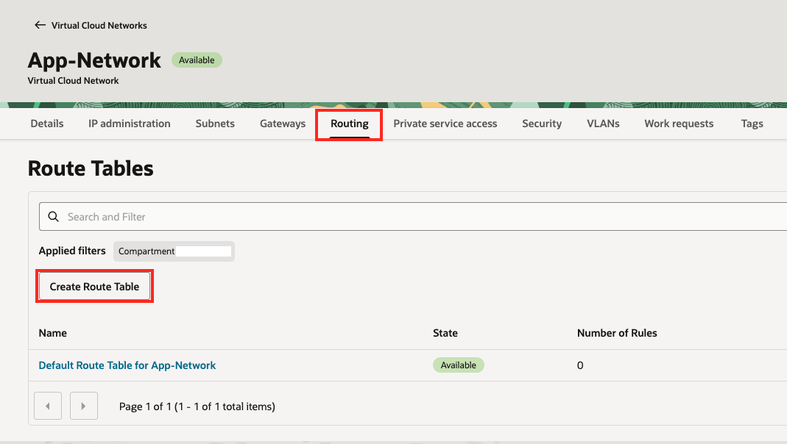

2. You will need to provide details including name and compartment, with the option to add route rules directly. The next steps will highlight how to create route rules after setting up your Route Table.
    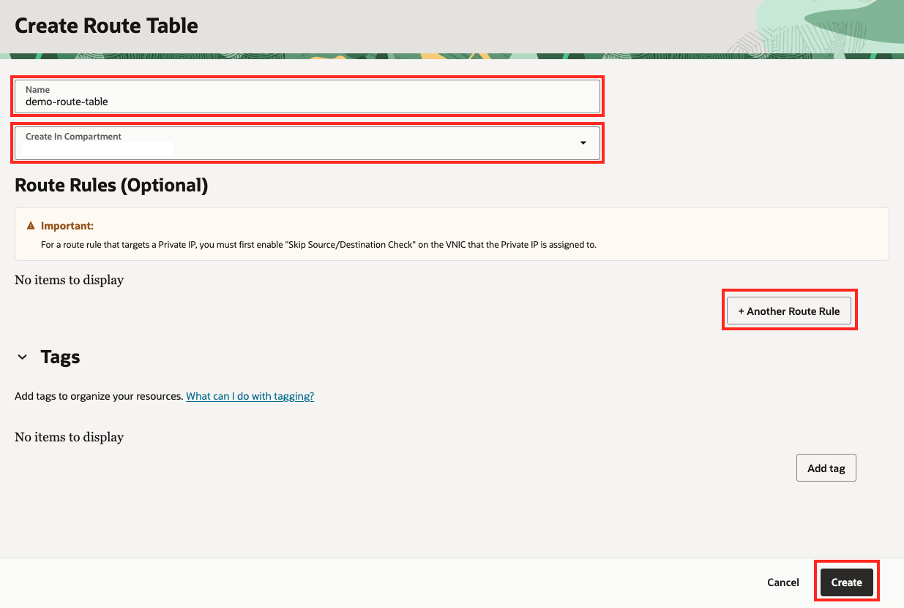

3. To create Route Tables, navigate to the Route Table you want to create rules for and then go to the Route Rules tab. Click **Add Route Rules**.

    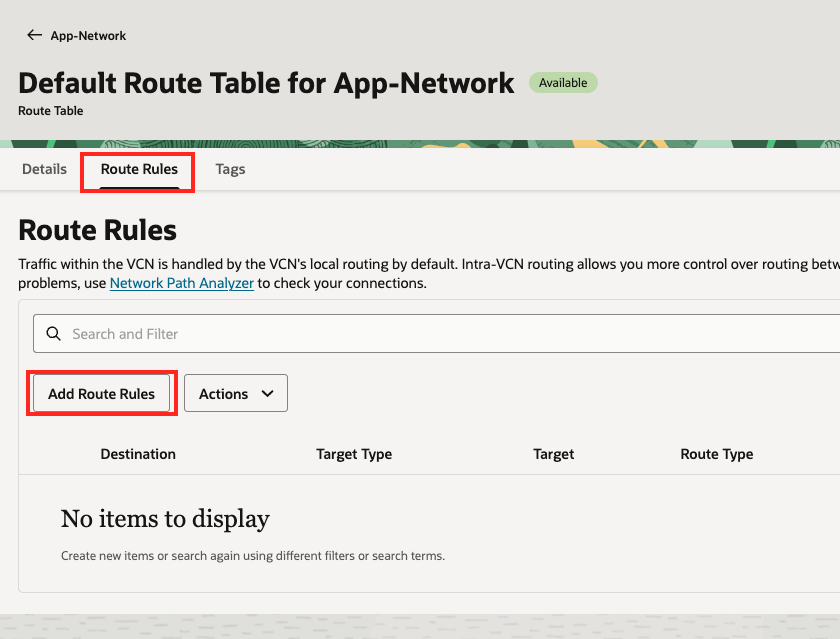

4. You will need to provide details including target type, destination CIDR block, target resource compartment, target resource, and a description. You can also add multiple Route Rules during this step.

    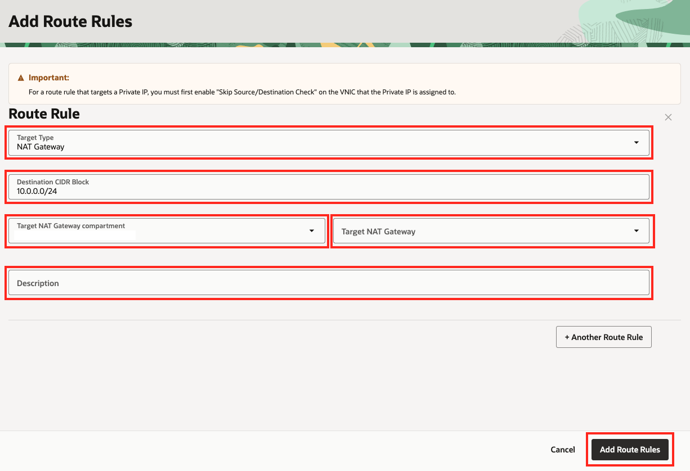

## Task 5: Security Lists & Network Security Groups

### **Security Lists**

If route tables determine where traffic goes, then security lists determine what traffic is allowed in or out. Security lists are firewalls attached to a subnet that checks every packet going in or out of the specified subnet. They contain rules that control ingress (inbound) and egress (outbound) traffic, destination CIDR block, Protocol specifications, Port details, and stateful(default) vs stateless. If you specify the rule as stateful, if you allow incoming traffic, you automatically allow the response back. Stateless means outbound traffic will not be automatically allowed - you must manually allow both directions.

A key feature about security lists is that they are applied at a subnet level. Every instance (VM) in that subnet must follow those rules.

### **Network Security Groups (NSG)**

Network Security Groups also control traffic allowed in and out. However, NSGs specifically target VNICs (Virtual Network Interface Card) instead of the entire subnet like security lists do, so you're able to control traffic per instance. For example, you could have 2 servers that need to follow different rules even though they’re in the same subnet. Security lists wouldn't be able to grant you that, but NSGs can. You can either attach a VNIC to an NSG either during creation or after. When creating a Network Security Group, you will also need to create rules. These rules contain the same requirements that security list rules follow: direction (ingress/egress), source/destination, protocol, port, stateful/stateless.

### **Security Lists VS. Network Security Groups**

| Feature | Security List | Network Security Group |
| :-------- | :--------: | :--------: |
| Scope | Subnet-level | VNIC-level |
| Granularity | same rules for all resources | rules applied per instance or group |
| Flexibility | limited | strong |
| Rule Targeting | CIDR-based only | CIDR and NSG to NSG rules |

### **Creating Security Lists and Rules**

1. To create a Security List, navigate to the Security tab for your VCN. Click **Create Security List**.

    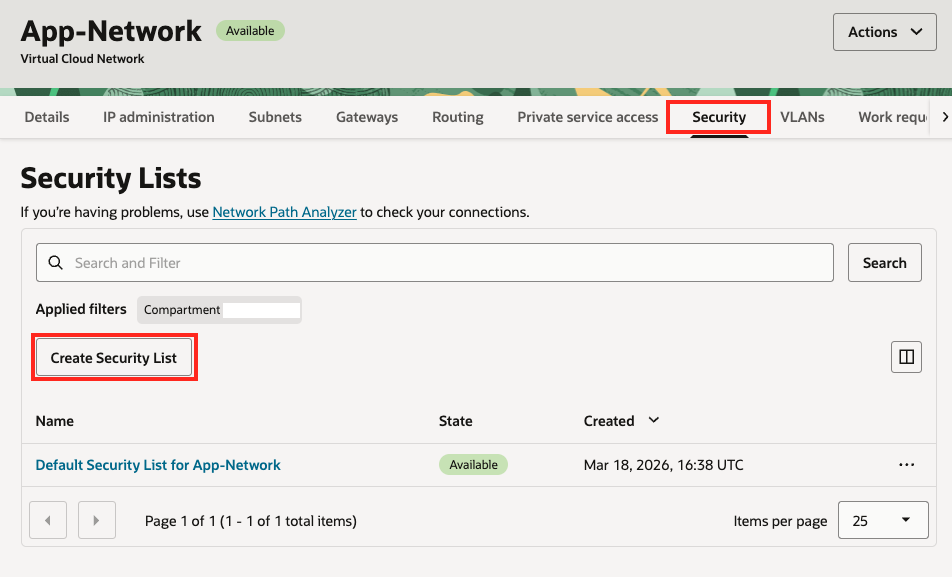

2. You will need to provide information including name, compartment, as well as specifications for ingress and egress rules.

    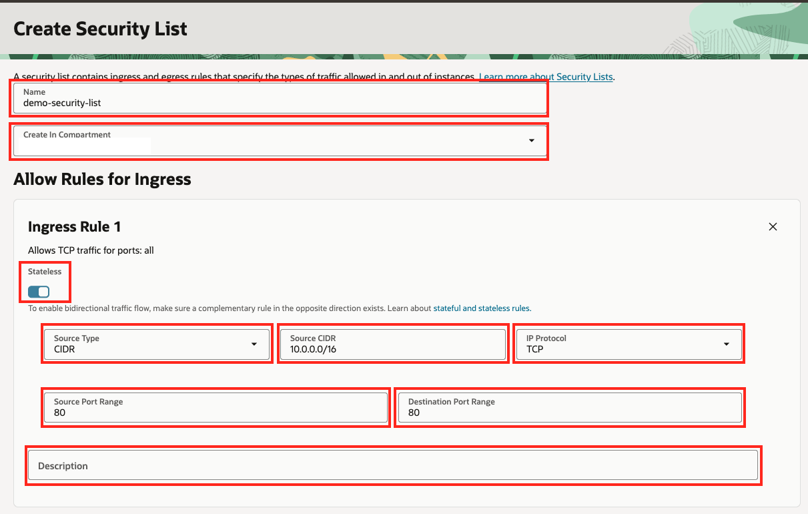
For ingress and egress rules, you will need to provide destination type and information, IP protocol, source and destination port range, and a description. You can also enable stateless rules.
    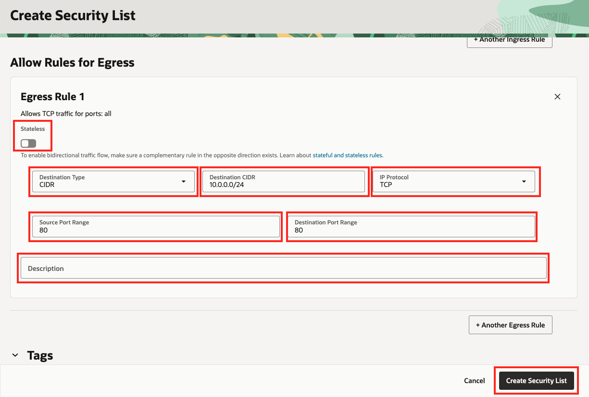

### **Creating Network Security Groups and Rules**

1. To create Network Security Groups, navigate to the Security tab for your VCN. Click **Create Network Security Group**.

    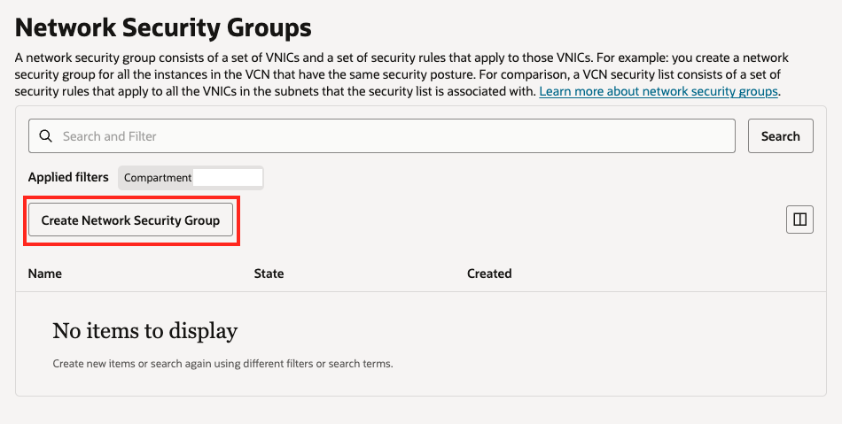

2. You will need to provide information including name, compartment details, and NSG rules. For NSG rules, they are similar to Security List rules. You need to indicate the ingress or egress direction, destination type and information, IP protocol, source and destination port range, and a description.  You can also enable stateless rules.

    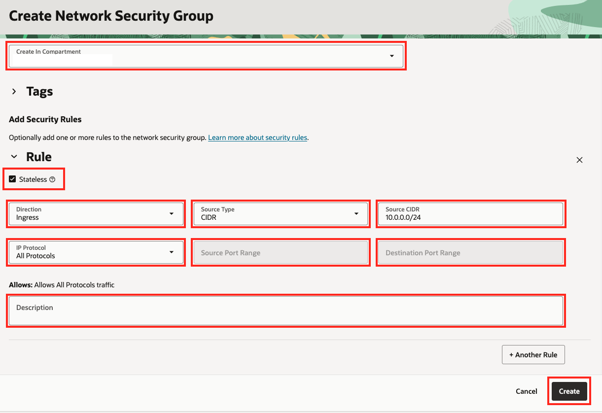

### Summary

VCns and subnets provide secure and customizable network environments, while route tables control how traffic is being routed in and out of the VCN. Gateways help you establish communication outside of your VCN. To secure your VCN, security lists and network security groups act as the control center, allowing specified traffic into your network. In real-world situations, you would create multiple VCNs based on their need for access (which ports to open) and who can access them. Both of these concepts are covered in the next lab ***Create a Compute Service***.

## Acknowledgements

- **Author** - Rajeshwari Rai, Prasenjit Sarkar, Wynne Yang
- **Contributors** - Oracle LiveLabs QA Team (Kamryn Vinson, QA Intern, Arabella Yao, Product Manager, DB Product Management), Wynne Yang
- **Last Updated By/Date** - Wynne Yang, April 2026

